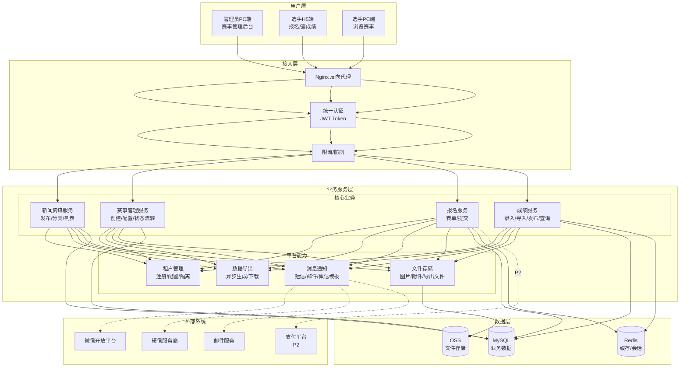
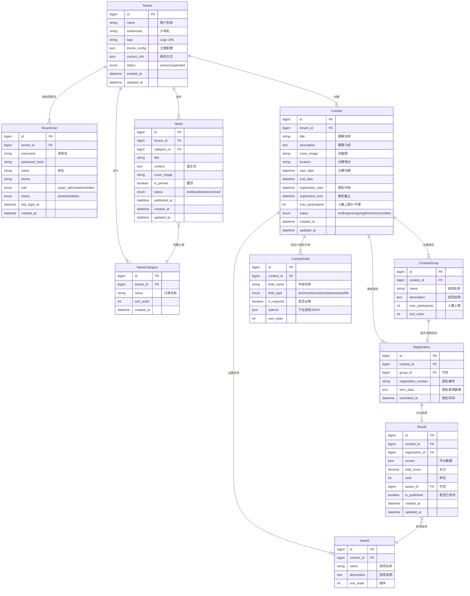
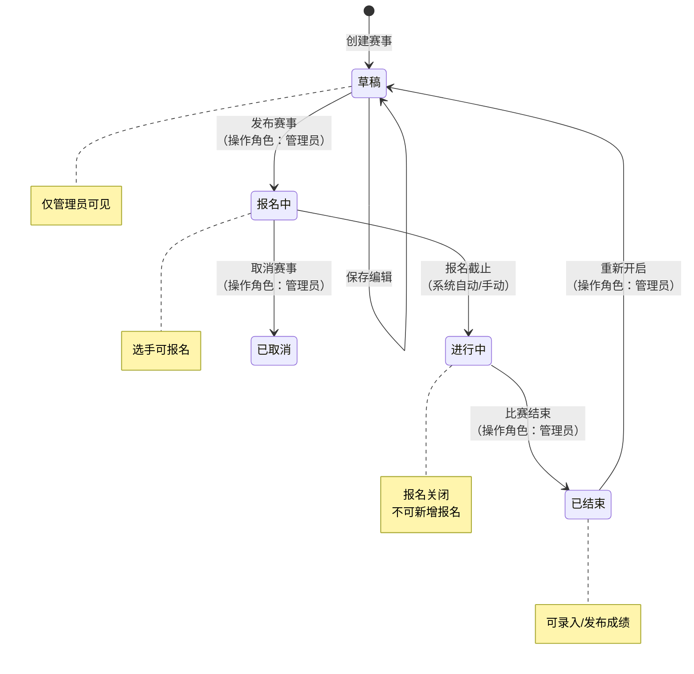
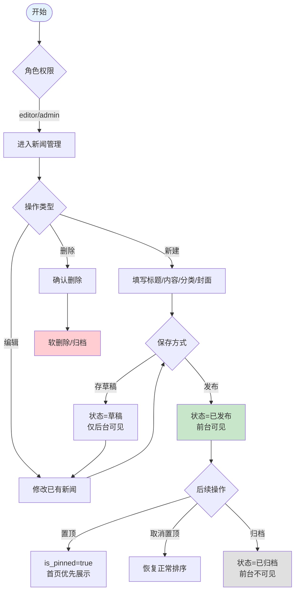
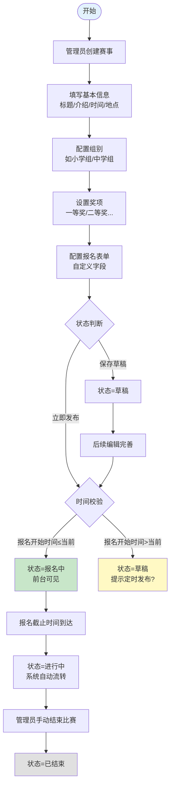
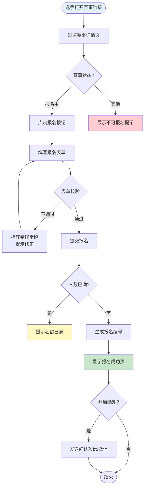
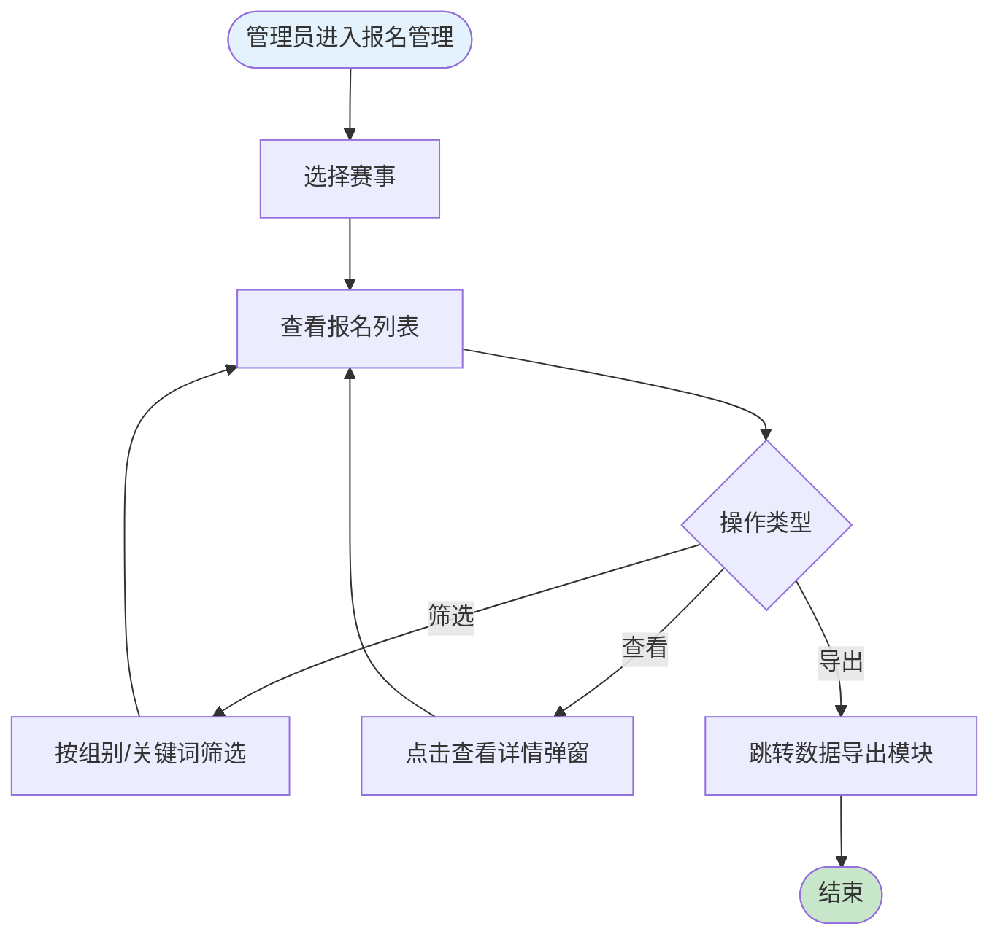
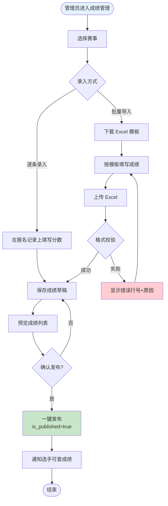
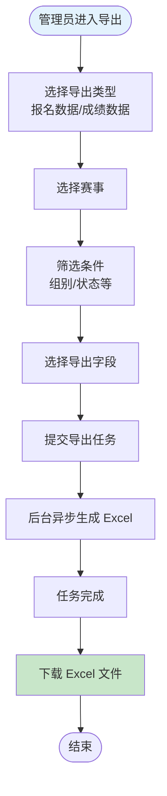

# 竞赛信息发布系统 PRD

| PRD 审核人 | [待填写] |
| --- | --- |
| 重要性 | 高 |
| 紧迫性 | 中 |
| 需求方 | 竞赛主办方/赛事运营机构 |
| PRD 编写人 | [待填写] |
| PRD 提交日期 | 2026-06-06 |

## PRD 修改记录

| 变更时间 | 变更内容 | 变更提出部门与理由 | 修改人 | 审核人 | 版本号 |
| --- | --- | --- | --- | --- | --- |
| 2026-06-06 | 初始版本 | — | [待填写] | [待填写] | v1.0 |

---

## 1、项目背景

### 1.1 业务现状

当前，各类学科竞赛、技能大赛、创新创业大赛等赛事活动举办频繁，但大量中小型赛事主办方（学校、行业协会、培训机构、企业）仍依赖以下方式运营赛事：

- **信息发布靠社交工具**：通过微信群、QQ群、公众号推文发布竞赛通知，信息分散且难以检索回溯；
- **报名靠表单工具**：使用问卷星、腾讯文档、金数据等通用表单收集报名信息，但无法做身份校验、资格审核、费用管理；
- **成绩发布靠邮件/文档**：比赛结束后通过邮件或在线表格公布成绩，选手查询体验差，数据安全无保障；
- **数据管理靠手工**：报名数据、成绩数据分散在不同工具中，导出整理依赖人工操作，容易出错。

> 💡 方法论提示：以上归纳基于 B端竞品调研五环节法中的"业务现状梳理"环节，从信息流、操作流、数据流三个维度定位痛点。

### 1.2 面临问题

按"影响范围 × 严重程度 × 紧迫度"排序，目标客户群体面临以下核心问题：

1. **选手数据难以统一管理导出**：核心痛点。每场比赛的报名数据散落在问卷星、Excel、微信群接龙中，赛后想要一份结构化的选手信息汇总表（含姓名、学校、联系方式、成绩、奖项），往往需要人工拼凑整理，耗时长且容易出错。客户最核心的诉求就是——**能方便地把参赛选手信息导出成 Excel**。
2. **缺乏一站式赛事信息发布能力**：为满足"导出数据"这一核心需求，数据必须先被收集上来。而当前没有专属的赛事页面来集中展示比赛信息、收集报名，只能拼凑公众号推文 + 问卷星表单，信息分散、品牌感弱。
3. **赛后成绩查询体验差**：比赛结束后，选手频繁私聊询问成绩，管理员逐一回复效率低下。需要一种"发布后选手自助查询"的方式。
4. **赛事运营工具碎片化**：发布通知、收集报名、公布成绩三个环节用了三四个不互通的工具，一场中等规模赛事（200-500人）运营下来，工作人员要在多个工具间反复横跳。
5. **缺乏轻量级专用工具**：市场上现有竞赛管理系统或过于重型（含在线评测、作品提交、代码评审等，学习成本高），或过于简陋（仅表单收集），缺少一个**专注信息发布+报名管理+成绩查询+数据导出**的轻量级 SaaS 工具。

### 1.3 解决思路

本项目定位为**轻量级竞赛信息发布与管理平台**，核心策略：

- **一站搞定**：将赛事信息发布、在线报名、成绩查询、数据导出集中在统一平台，主办方无需在多个工具间跳转；
- **轻量聚焦**：不承载作品提交、在线评测、排行榜等重型功能，降低主办方的学习成本和使用门槛，专注做好"发新闻→办赛事→查成绩→导数据"核心闭环；
- **品牌化门户**：为主办方提供可独立分享的赛事门户页面（H5/PC），选手通过链接即可访问，无需下载 App；
- **数据沉淀**：自动归档每场赛事的选手数据和成绩数据，支持跨赛事检索与复用。

### 1.4 决策依据

| 序号 | 依据项 | 说明 |
| --- | --- | --- |
| 1 | 市场空白 | 聚焦"轻量级竞赛信息发布"赛道的 SaaS 产品稀缺，参考竞品（如 hbkc.org.cn）验证了该模式的市场需求 |
| 2 | 客户验证 | [TODO: 请补充已完成或计划中的客户访谈/调研数据] |
| 3 | 技术可行性 | Web 端 SaaS 架构成熟，核心功能（CMS + 表单 + 数据导出）技术栈已验证，开发风险低 |
| 4 | 商业可行性 | 赛道垂直、客群清晰（学校/协会/培训机构），可通过 SaaS 订阅 + 增值服务实现商业化 |

---

## 2、需求基本情况

| 要素 | 内容 |
| --- | --- |
| **需求提出人** | 赛事主办方运营负责人（如学校教务处、协会秘书处、培训机构赛事部） |
| **功能使用人** | ① 赛事管理员（主办方工作人员，后台操作）；② 参赛选手（前台报名/查成绩）；③ 系统管理员（平台运维） |
| **受影响人** | ① 赛事评委/裁判（需查看选手名单或录入成绩）；② 主办方管理层（查看赛事数据报表）；③ 选手家长/指导老师（陪同查询成绩） |
| **场景描述** | 见下方核心场景 |
| **发生频率** | 赛事管理员：每场赛事期间日均操作 10-20 次；参赛选手：报名窗口期集中访问，单赛事 PV 约 500-5000 |
| **核心痛点** | 中小型赛事主办方缺少一个轻量级、开箱即用的赛事信息发布与管理工具，不得不在多个通用工具间拼凑流程 |
| **需求价值** | 将单场赛事运营效率提升 50%+，选手报名体验从碎片化转向一站式，数据资产从分散 Excel 变为结构化可复用档案 |

### 核心场景描述

> 💡 场景六要素：人物、时间、地点、起因、经过、结果

**场景1：赛事管理员发布竞赛并管理报名**

- **人物**：赛事管理员（如学校王老师），负责某省级学科竞赛的组织工作，非技术背景，习惯使用微信和 Excel
- **时间**：赛前 4-6 周，工作日上班时间
- **地点**：办公室电脑前，偶尔用手机查看报名进度
- **起因**：接到上级通知，需在一个月内完成赛事宣传、报名收集、选手信息整理
- **经过**：以往需要在公众号发推文 → 用问卷星做报名表 → 手工核对报名信息 → 微信群里答疑 → 导出 Excel 整理选手名单，整个流程需跨 4-5 个工具
- **结果**：信息分散导致选手反复询问报名链接在哪里、报名是否成功，王老师需逐一回复，耗时巨大且容易遗漏

**场景2：参赛选手搜索赛事并报名**

- **人物**：参赛选手小李，在校大学生，通过老师分享的链接或二维码获知比赛
- **时间**：报名窗口期内，课余时间（晚间/周末居多）
- **地点**：手机上操作
- **起因**：指导老师在微信群发了一个竞赛报名链接，小李需要完成报名
- **经过**：打开链接 → 浏览赛事详情（比赛时间、地点、组别、奖项设置）→ 填写个人信息 → 提交报名 → 收到确认通知
- **结果**：期望能即时确认报名成功，并能在后续随时回到平台查询比赛安排和最终成绩

**场景3：赛后成绩发布与查询**

- **人物**：赛事管理员发布成绩；参赛选手小张查询个人成绩
- **时间**：比赛结束后 1-7 天
- **地点**：管理员在电脑端操作；选手在手机上查询
- **起因**：评委完成评分，管理员需将成绩整理发布，选手迫切想知道结果
- **经过**：管理员后台导入/录入成绩 → 核实无误后一键发布 → 选手通过报名时获得的编号+身份信息查询个人成绩
- **结果**：选手自助查询，管理员无需逐一通知，大幅减少赛后沟通工作量

**场景4：赛事数据导出与归档**

- **人物**：赛事管理员
- **时间**：比赛结束后 1-2 周
- **地点**：办公室电脑
- **起因**：主办方需要向上级单位报送参赛选手名单、成绩汇总表，同时归档留存
- **经过**：管理员在后台筛选本场赛事 → 选择导出字段（姓名、学校、组别、成绩、奖项等）→ 一键导出 Excel
- **结果**：结构化数据直接可用，无需二次整理，归档后可跨赛事检索历史选手信息

---

## 3、商业分析

> 💡 方法论基础：《决胜B端》产业链分析 + STP 市场细分 + 竞品分析框架

### 3.1 目标市场与客户分析

| 分析维度 | 内容 |
| --- | --- |
| **目标市场** | 中国中小型赛事主办机构的信息化管理工具市场。覆盖学科竞赛、技能大赛、创新创业大赛、文化艺术比赛等细分赛道 |
| **市场规模** | [TODO: 请补充 TAM/SAM/SOM 估算数据。建议参考：中国每年各级各类竞赛活动数量（教育系统+行业协会+企业）、可服务市场（中小型赛事占比）、预计渗透率] |
| **市场特征** | 长尾市场，头部赛事（国家级、省级）有定制化系统，腰部以下（校级、区县级、企业内赛）大量依赖通用工具拼凑；客户价格敏感但对效率提升有明确诉求；决策链短（通常1-2人即可决策采购） |
| **发展趋势** | ① 赛事数字化转型加速，疫情后线上/混合赛事常态化；② 政策推动素质教育与竞赛活动规范化（教育部白名单赛事等）；③ 中小型赛事主办方从"能用就行"向"专业化运营"升级 |
| **客户画像** | **行业**：教育（大学/中学教务处、团委）、行业协会（学会/研究会）、培训机构（编程/机器人/艺术类）、企业（HR/品牌部办员工技能赛）。**规模**：单场赛事选手 50-2000 人。**IT 成熟度**：中低，习惯使用微信生态工具，对 SaaS 接受度中等。**决策特征**：预算有限（单场赛事预算通常在 500-5000 元用于工具采购） |
| **客户痛点** | ① 工具碎片化，一场赛事用 4-5 个不互通工具；② 选手体验差，弃赛率高；③ 数据无法沉淀复用；④ 缺乏品牌化赛事门户；⑤ 无轻量级专用 SaaS |
| **卖点提炼** | **"3分钟建站，一站搞定赛事宣传、报名、成绩发布——让每场竞赛都专业高效"** |

### 3.2 竞品分析

| 分析维度 | 竞品A：赛氪 saikr.com | 竞品B：问卷星/金数据 | 竞品C：hbkc.org.cn 类平台 | 我方产品 |
| --- | --- | --- | --- | --- |
| **商业模式** | 免费+增值服务（证书、评审） | 免费+付费会员 | 政府/机构定制化项目 | SaaS 订阅 + 增值服务 |
| **目标客户** | 高校学术竞赛 | 所有行业通用表单需求 | 政府/大型机构赛事 | 中小型赛事主办方 |
| **运营推广策略** | 高校合作+社群运营 | 口碑+搜索广告 | 项目制BD | 内容营销+行业合作+代理商渠道 [TODO] |
| **市场份额** | 高校学术赛道头部 | 通用表单市场头部 | 区域性政府项目 | 新进入者 |
| **核心功能** | 竞赛发布+报名+论文提交+评审+证书 | 万能表单+数据收集+导出 | 信息发布+报名+成绩 | 新闻CMS+赛事发布+报名+成绩查询+数据导出 |
| **核心价值** | 学术竞赛一站式 | 万能数据收集 | 政务赛事数字化 | 轻量级竞赛信息管理专用工具 |
| **优势** | 功能全面、高校渗透深 | 品牌知名度高、学习成本低 | 政府背书、定制化强 | 聚焦垂直场景、轻量开箱即用、品牌化门户 |
| **劣势** | 重型、学习成本高、不适合小型赛事 | 非竞赛专用、无品牌化、无成绩管理 | 非标产品、不可规模化 | 品牌新、功能深度待积累 |

### 3.3 差异化定位

基于以上分析，本产品的差异化竞争策略聚焦以下三个维度：

| 差异化维度 | 策略描述 |
| --- | --- |
| **垂直聚焦** | vs 问卷星等通用工具：不做万能表单，专做竞赛场景，内置赛事信息模板、报名表单模板、成绩查询模板，上手即可用 |
| **轻量优先** | vs 赛氪等重平台：不做作品提交、在线评测、排行榜、评委系统，将"新闻→赛事→报名→成绩"链路做到极致简单，目标用户 10 分钟内完成首场赛事搭建 |
| **品牌化门户** | vs hbkc.org.cn 类定制项目：SaaS 模式下每个客户拥有独立赛事门户页，支持自定义品牌 Logo、主题色、域名绑定，让小型赛事也能呈现专业品牌形象 |

### 3.4 SaaS 商业模型预估

| 指标 | 预估值 | 说明 |
| --- | --- | --- |
| **目标定价** | 免费版（单赛事≤50人）+ 标准版 ¥199/月 + 专业版 ¥499/月 | 三级定价覆盖不同规模客户 |
| **CAC（获客成本）** | ¥800-1500（初期） | 含内容营销+渠道合作+销售人力分摊 |
| **LTV（客户生命周期价值）** | ¥12,000-24,000 | 假设 ARPU ¥3000/年 × 4-8年生命周期 |
| **LTV/CAC** | 8-15（目标） | 乐观估算，需实际跑数据验证 |
| **目标 Churn Rate** | 月流失率 < 5% | SaaS 行业健康基准 |
| **回本周期** | 3-6 个月 | CAC / 月均 ARPU |

> 💡 SaaS 健康基线：LTV/CAC > 3，回本周期 < 12 个月。以上为初始预估，需产品上线 6 个月后根据实际数据校准。

---

## 4、项目收益目标

> 💡 方法论基础：SMART 原则（具体、可衡量、可实现、相关性、有时限）

### 4.1 项目目标

| 目标类型 | 目标描述 | 衡量指标 | 目标值 | 达成时限 |
| --- | --- | --- | --- | --- |
| **核心业务目标** | 验证产品市场匹配（PMF） | 付费客户数 + 免费转付费转化率 | ≥50 付费客户，转化率 ≥10% | 上线后 6 个月 |
| **核心业务目标** | 建立可持续收入模型 | MRR（月度经常性收入） | MRR ≥ ¥10,000 | 上线后 12 个月 |
| **效率目标** | 降低赛事运营耗时 | 单场赛事平均运营耗时（发布→成绩公布全流程） | 较现有方式减少 50%+ | 上线后 3 个月（通过客户访谈验证） |
| **体验目标** | 选手报名体验流畅 | 报名完成率（进入报名页 → 成功提交） | ≥ 85% | 上线后 3 个月 |
| **体验目标** | 客户满意度 | NPS 净推荐值 | ≥ 30 | 上线后 6 个月 |

### 4.2 验收标准

项目交付时须满足以下标准：

1. **功能完整性**：新闻发布、赛事管理、选手报名、成绩查询、数据导出五大核心模块功能完整可用，通过测试验证。
2. **性能标准**：核心接口响应时间 P95 < 2s（报名提交、成绩查询等）；页面首屏加载时间 < 3s。
3. **安全合规**：选手个人信息传输加密（HTTPS）、后台数据导出操作留审计日志、满足基础个人信息保护合规要求。
4. **多终端适配**：前台页面（赛事详情、报名、成绩查询）在主流移动端和 PC 端浏览器正常渲染。
5. **数据准确性**：报名信息、成绩数据的导入/导出/查询结果与原始数据一致，无错漏。

### 4.3 成功标准

> 项目上线后 **6 个月** 内，达到以下指标视为成功：

1. **客户规模**：累计注册赛事主办方 ≥ 200 家，其中付费客户 ≥ 50 家。
2. **赛事量**：平台累计创建赛事 ≥ 500 场，单月活跃赛事 ≥ 50 场。
3. **选手触达**：通过平台完成报名的选手累计 ≥ 10,000 人次。
4. **客户留存**：付费客户月度流失率 < 8%，免费版留存率（30日内有操作）≥ 40%。
5. **迭代速度**：上线后保持每月至少 1 次功能迭代，响应客户核心诉求。 [TODO: 请与业务方确认以上成功标准的目标值是否合理]

---

## 5、项目方案概述

> 💡 方法论基础：《决胜B端》自顶向下设计思路 — 先全景后细节

### 5.1 核心功能概述

| 序号 | 功能模块 | 功能简述 | 优先级 |
| --- | --- | --- | --- |
| 1 | **新闻资讯管理** | 后台发布/编辑/置顶新闻资讯，支持分类和富文本，前台新闻列表展示 | P0 |
| 2 | **赛事管理** | 创建赛事、配置赛事信息（时间、地点、组别、奖项等）、赛事状态流转（草稿→报名中→进行中→已结束） | P0 |
| 3 | **在线报名** | 选手通过分享链接/二维码进入赛事页，填写报名信息并提交，支持报名后查看报名状态 | P0 |
| 4 | **报名管理** | 后台查看/筛选报名记录，支持查看详情、删除和导出 | P0 |
| 5 | **成绩管理** | 后台录入/导入成绩，成绩发布与撤回，选手前端自助查询个人成绩 | P0 |
| 6 | **数据导出** | 按赛事导出报名数据、成绩数据为 Excel，支持自定义导出字段 | P0 |
| 7 | **选手中心** | 选手个人页面，查看我的报名记录、我的成绩，支持个人信息维护 | P1 |
| 8 | **租户门户配置** | 租户自定义首页 Banner、Logo、主题色、联系方式，打造品牌化赛事门户 | P1 |
| 9 | **消息通知** | 报名成功通知、赛前提醒、成绩发布通知（微信模板消息/短信/邮件） | P1 |
| 10 | **数据看板** | 后台首页展示赛事数据概览（报名人数趋势、赛事数量、访问量等） | P2 |
| 11 | **报名缴费** | 在线支付报名费（微信支付），支持免费/付费赛事配置 | P2 |
| 12 | **证书生成** | 根据成绩/奖项批量生成电子证书，选手可下载 | P2 |

### 5.2 方案概述

- **产品方案**：SaaS 多租户模式，每个主办方拥有独立后台和赛事门户页面，通过链接/二维码触达选手。前端轻量 H5 页面适配移动端，后台采用标准管理后台布局。
- **技术方案**：
  - **后端**：Python + FastAPI（异步高性能，类型安全，自动生成 API 文档），SQLAlchemy 2.0 async ORM，Alembic 数据库迁移
  - **前端**：React 18 + TypeScript + Vite，UI 组件库采用 **shadcn/ui**（基于 Radix UI 无头组件 + Tailwind CSS），风格现代、可定制性强、To C 视觉表现优秀。管理后台使用 shadcn/ui 配合 TanStack Table 实现复杂表格。前台选手端注重移动端适配和交互动效
  - **数据库**：PostgreSQL（JSON 字段支持灵活表单数据存储）+ Redis（缓存/会话/限流）
  - **部署**：Docker Compose 容器化部署，Nginx 反向代理，后续可平滑迁移至 K8s
  - **架构**：MVP 阶段采用单体应用 + 模块化设计，预留服务化拆分接口
- **运营方案**：冷启动阶段以免费版吸引种子客户 → 收集反馈迭代 → 内容营销（赛事运营指南、模板分享）获客 → 付费功能转化。初期以教育行业为切入点。

### 5.3 MVP 范围

> 💡 B端 MVP 原则：必须支撑核心业务流程闭环，不是"最简单的版本"

**MVP 包含的功能（P0）：**

| 模块 | MVP 范围 | 理由 |
| --- | --- | --- |
| 新闻资讯管理 | 基本发布/编辑/列表，单图配文 | 支撑赛事宣传需求，建立门户内容基础 |
| 赛事管理 | 创建赛事+基础字段配置+状态流转 | 核心业务起点 |
| 在线报名 | 选手端报名表单+提交确认 | 核心业务闭环的必要环节 |
| 报名管理 | 后台查看列表+筛选+导出 | 管理员日常工作刚需 |
| 成绩管理 | 后台录入/导入+发布+选手端查询 | 完整赛后闭环 |
| 数据导出 | Excel 导出报名数据+成绩数据 | 客户核心诉求，无法妥协 |
| 多租户基础 | 注册即开通租户，租户隔离 | SaaS 基础架构 |

**MVP 暂不包含的功能：**

| 功能 | 延后理由 |
| --- | --- |
| 选手中心（P1） | 报名+查成绩可通过链接直接完成，选手中心锦上添花 |
| 品牌化门户配置（P1） | MVP 使用默认模板即可，优先验证业务闭环 |
| 消息通知（P1） | MVP 可用页面反馈替代短信/邮件通知 |
| 数据看板（P2） | 初期数据量小，暂不需要可视化分析 |
| 在线缴费（P2） | 初期聚焦免费赛事场景，降低支付接入复杂度 |
| 证书生成（P2） | 非核心闭环必须，赛后环节可后续补充 |

**核心验证假设：**

1. **需求假设**：中小型赛事主办方愿意为"轻量级竞赛信息管理工具"付费，且免费转付费转化率达到预期。
2. **行为假设**：选手能通过分享链接顺利完成报名全流程，移动端报名完成率 ≥ 80%。
3. **价值假设**：使用产品后，客户单场赛事运营耗时减少 40%+，满意度显著提升。

---

## 6、项目范围

### 6.1 涉及系统

| 系统名称 | 关系类型 | 影响描述 | 责任方 |
| --- | --- | --- | --- |
| 竞赛信息发布平台（本系统） | 主体 | 新建 | 产品研发团队 |
| 微信开放平台 | 对接 | 微信登录、二维码/链接分享、模板消息通知（P1） | 微信开放平台 + 我方对接 |
| 短信服务商（如阿里云短信） | 对接 | 报名确认、赛前提醒、成绩发布通知（P1） | 第三方服务商 + 我方对接 |
| 邮件服务（如 SendCloud） | 对接 | 成绩通知邮件、数据导出大文件发送（P1） | 第三方服务商 + 我方对接 |
| 云存储（OSS/S3） | 对接 | 新闻图片、赛事封面图、证书文件（P2）存储 | 云服务商 + 我方对接 |
| 微信支付 / 支付宝 | 对接 | 报名费在线支付（P2） | 支付平台 + 我方对接 |

### 6.2 影响范围

- **用户影响**：赛事主办方工作人员（从现有 Excel+问卷星 工作方式迁移到平台）；参赛选手（从多渠道碎片信息获取转为统一平台入口）。
- **流程影响**：赛事运营流程从"多工具串联"变为"平台内闭环"，管理员工作习惯需适配，建议提供操作视频指南降低迁移成本。
- **数据影响**：无存量数据迁移（新系统），但需设计好数据模型以支持未来从 Excel 批量导入历史数据。
- **上下游影响**：暂不涉及对第三方系统的数据推送义务，后续版本可能增加（如向主管单位报送数据）。

### 6.3 不在本期范围内

以下内容明确排除，避免范围蔓延：

| 序号 | 排除项 | 排除理由 |
| --- | --- | --- |
| 1 | 比赛进程跟踪/进度展示 | 用户明确表示暂不需要，且进度管理涉及复杂的赛程编排，与"轻量级"定位冲突 |
| 2 | 排行榜/实时排名 | 暂不需要，排行榜通常需配合评分系统，超出 MVP 范围 |
| 3 | 作品在线提交与评审 | 涉及文件存储、格式校验、评委在线打分等复杂功能，属于重量级竞赛系统范畴 |
| 4 | 在线考试/评测系统 | 与当前定位不符，属于专业考试系统或 OJ（Online Judge）系统范畴 |
| 5 | 社区/论坛/讨论区 | 非核心需求，且社区运营成本高，冷启动期不适合 |
| 6 | 移动端 App（iOS/Android） | H5 响应式页面已可满足选手报名查成绩需求，App 开发成本高，暂不投入 |
| 7 | 多级分销/裂变营销 | 赛事传播以自然分享为主，暂不引入营销插件 |
| 8 | API 开放平台 | 初期以 SaaS 产品为主，开放 API 在客户积累阶段后考虑 |
| 9 | 多语言国际化 | 初期聚焦中文市场

---

## 7、项目风险

### 7.1 前提假设

| 编号 | 假设内容 | 如果假设不成立的影响 |
| --- | --- | --- |
| A1 | 目标客户（中小赛事主办方）对 SaaS 工具接受度良好，愿意在线管理赛事 | 获客困难，需额外投入客户教育成本，或调整产品形态（如提供私有化部署） |
| A2 | 选手主要通过微信/手机浏览器访问，且能独立完成报名操作 | 如果选手群体偏高龄或低龄，可能需要提供代报名、批量导入等功能 |
| A3 | 赛事主办方有基本的电脑操作能力，能独立完成后台管理 | 需增加操作引导、在线客服支持、甚至代运营服务 |
| A4 | 微信生态（分享链接、小程序等）的政策不发生重大变化 | 如微信限制外链分享，需调整获客和触达策略 |

### 7.2 约束条件

| 编号 | 约束描述 | 对设计的影响 |
| --- | --- | --- |
| C1 | 初期团队规模有限（预估 3-5 人研发） | 技术架构需简单务实，避免过早微服务化；MVP 聚焦核心闭环 |
| C2 | 预算有限，需控制第三方服务成本 | 消息通知、云存储等 P1/P2 功能需仔细评估成本，优先使用免费额度 |
| C3 | 选手个人信息需合规处理（《个人信息保护法》） | 报名表单需展示隐私政策、数据最小化收集、提供数据删除入口 |
| C4 | 产品定位为轻量级，不可功能膨胀 | 严格的优先级管理和需求评审机制，新增功能必须通过定位检验 |

### 7.3 风险清单

| 编号 | 风险类别 | 风险描述 | 发生概率 | 影响程度 | 应对方案 |
| --- | --- | --- | --- | --- | --- |
| R1 | 产品风险 | 客户需求分散，不同赛事类型的报名表单字段差异大，标准化困难 | 高 | 中 | 提供可配置的自定义报名字段（字段类型、必填/选填），覆盖 80% 场景；极端定制需求走工单/人工支持 |
| R2 | 产品风险 | 竞品（如赛氪）推出轻量版或免费策略挤压市场 | 中 | 高 | 强化"轻量+品牌化门户"差异化定位，快速积累种子客户口碑，建立迁移成本（历史赛事数据沉淀） |
| R3 | 运营风险 | 冷启动期缺乏内容（新闻、赛事），前台页面空洞，影响新访客信任 | 高 | 中 | 提供示例赛事模板、引导客户首批创建赛事时填充内容；管理后台引导式 onboarding 流程 |
| R4 | 技术风险 | 成绩发布环节高并发查询（数千选手同时查成绩）导致服务压力 | 中 | 中 | 成绩查询为读多写少场景，使用 Redis 缓存成绩数据；发布时预热缓存；前端限制查询频率 |
| R5 | 技术风险 | 数据导出功能在大数据量（万级选手）下超时或内存溢出 | 中 | 中 | 导出任务异步化：提交导出请求 → 后台生成 Excel → 通知下载，避免同步等待超时 |
| R6 | 合规风险 | 选手个人信息泄露或被未授权访问 | 低 | 高 | 后台操作审计日志；敏感信息脱敏展示；数据导出权限控制；定期安全扫描 |

---

## 8、术语和缩略语

| 术语/缩略语 | 全称 | 定义说明 |
| --- | --- | --- |
| 租户（Tenant） | — | SaaS 系统中，每个赛事主办方即为一个租户，拥有独立的数据空间和管理后台 |
| 赛事（Contest） | — | 平台中一次完整的竞赛活动，包含赛事信息、报名、成绩等完整生命周期 |
| 选手（Contestant） | — | 报名参加赛事的个人，是前台功能的主要使用者 |
| 赛事管理员（Admin） | — | 主办方工作人员，负责后台创建赛事、管理报名、发布成绩、导出数据 |
| MRR | Monthly Recurring Revenue | 月度经常性收入，SaaS 核心营收指标 |
| ARPU | Average Revenue Per User | 每用户平均收入 |
| CAC | Customer Acquisition Cost | 客户获取成本 |
| LTV | Lifetime Value | 客户生命周期价值 |
| Churn Rate | — | 客户流失率 |
| NPS | Net Promoter Score | 净推荐值，衡量客户满意度和忠诚度 |
| PMF | Product Market Fit | 产品市场匹配 |
| MVP | Minimum Viable Product | 最小可行产品 |

## 9、参考文献和引用文档

| 文档名称 | 版本 | 链接/位置 | 说明 |
| --- | --- | --- | --- |
| 参考竞品 — 湖北科创大赛 | — | https://hbkc.org.cn/ | 竞赛信息发布与报名系统的参考案例 |
| 赛氪 | — | https://saikr.com/ | 学术竞赛平台竞品 |
| 《个人信息保护法》 | 2021 | — | 选手个人信息收集与处理的合规依据 |
| 《决胜B端—产品经理升级之路》 | 第2版 | — | B端产品设计方法论参考 |
| [TODO: 请补充其他竞品链接、内部调研文档、客户访谈记录等] | | | |

---

## 10、功能需求

### 10.1 产品框架概述

#### 10.1.1 应用架构图

#### 10.1.2 数据模型图（ER 图）

> 💡 ER建模三步法：找实体 → 梳关系 → 确定关键属性

**实体说明表：**

| 实体 | 核心属性说明 | 业务规则 |
| --- | --- | --- |
| Tenant | 租户信息 + 品牌配置（Logo/主题色/联系方式） | 注册即创建租户，数据按 tenant_id 隔离；可配置独立子域名 |
| TenantUser | 租户下的管理员账号 | 角色分 super_admin（租户创建者）、admin（可管理所有赛事）、editor（仅可编辑新闻） |
| NewsCategory | 新闻分类 | 每个租户独立分类，默认含：赛事通知、行业动态、获奖公告 |
| News | 新闻内容 | 支持草稿/发布/归档状态流转；置顶新闻优先展示；编辑需 editor 以上角色 |
| Contest | 赛事核心信息 | 状态流转见 10.1.4 状态机；超过报名截止时间自动关闭报名 |
| ContestGroup | 赛事组别（如：小学组/中学组/大学组） | 组别人数上限独立控制；选手报名时选择组别 |
| ContestField | 自定义报名字段 | 系统默认字段（姓名、手机号）+ 管理员自定义字段（如学校、指导老师） |
| Registration | 报名记录 | 报名编号自动生成（格式：CONTEST_ID + 日期 + 序号）；form_data 存储完整表单 JSON；提交即报名成功，无需审核 |
| Award | 奖项设置 | 如：一等奖、二等奖、三等奖、优秀奖；可配置数量 |
| Result | 成绩记录 | 一个报名对应零或一条成绩；scores 以 JSON 存储灵活评分结构；is_published 控制选手端可见 |

#### 10.1.3 核心业务流程图

> 💡 泳道图展示多角色协作流程

```mermaid
flowchart TD
    subgraph 管理员
        A1([开始]) --> A2[创建赛事<br/>填写基本信息]
        A2 --> A3[配置组别与奖项]
        A3 --> A4[设置报名表单字段]
        A4 --> A5[发布赛事<br/>状态→报名中]
        A5 --> A6[分享链接/二维码]
        A6 --> A7[查看报名数据<br/>随时导出 Excel]
        A7 --> A8[赛后录入/导入成绩]
        A8 --> A9{成绩核实无误?}
        A9 -->|是| A10[一键发布成绩]
        A9 -->|否| A8
        A10 --> A11[导出成绩数据归档]
        A11 --> A12([结束])
    end

    subgraph 选手
        B1([收到链接]) --> B2[浏览赛事详情]
        B2 --> B3[填写报名表单]
        B3 --> B4[提交报名]
        B4 --> B5[报名成功<br/>获取报名编号]
        B5 --> B6[等待比赛]
        B6 --> B7[赛后访问查询页]
        B7 --> B8[输入报名编号+<br/>身份信息验证]
        B8 --> B9{验证通过?}
        B9 -->|是| B10[查看个人成绩]
        B9 -->|否| B8
        B10 --> B11([结束])
    end

    style A1 fill:#E3F2FD
    style A12 fill:#C8E6C9
    style B1 fill:#E3F2FD
    style B11 fill:#C8E6C9
    style A9 fill:#FFF9C4
    style B9 fill:#FFF9C4
```

#### 10.1.4 状态机图

**赛事（Contest）状态机：**

**赛事状态转换表：**

| 当前状态 | 触发事件 | 目标状态 | 操作角色 | 约束条件 |
| --- | --- | --- | --- | --- |
| — | 创建赛事 | 草稿 | 管理员 | 必填标题 |
| 草稿 | 发布赛事 | 报名中 | 管理员 | 报名开始时间 ≤ 当前时间 |
| 草稿 | 保存编辑 | 草稿 | 管理员 | — |
| 报名中 | 报名截止时间到达 | 进行中 | 系统自动 | 到达 registration_end 时间 |
| 报名中 | 手动关闭报名 | 进行中 | 管理员 | — |
| 报名中 | 取消赛事 | 已取消 | 管理员 | 需二次确认 |
| 进行中 | 比赛结束 | 已结束 | 管理员 | — |
| 已结束 | 重新开启 | 草稿 | 管理员 | 清空状态后复用赛事信息 |
| 已取消 | — | 终态 | — | 不可恢复（可复制创建新赛事） |

**报名（Registration）**：提交即报名成功，无审核环节，无状态流转。报名记录仅有一个生命周期事件：提交 → 存在。删除为软删除（需管理员操作）。

#### 10.1.5 功能清单

| 子系统 | 页面/功能 | PC端（管理后台） | H5端（选手前台） | PC端（选手前台） | 说明 |
| --- | --- | --- | --- | --- | --- |
| **租户门户** | 赛事门户首页 | — | ✓ | ✓ | 选手访问的落地页，展示新闻列表+赛事列表 |
| | 新闻详情页 | — | ✓ | ✓ | 富文本内容展示 |
| | 赛事详情页 | — | ✓ | ✓ | 赛事介绍+报名入口+成绩查询入口 |
| **新闻管理** | 新闻列表 | ✓ | — | — | 支持分类筛选、状态筛选、关键词搜索 |
| | 新闻编辑 | ✓ | — | — | 富文本编辑器+封面图上传 |
| | 新闻分类管理 | ✓ | — | — | 增删改查 |
| **赛事管理** | 赛事列表 | ✓ | — | — | 按状态 Tab 切换，支持搜索 |
| | 创建/编辑赛事 | ✓ | — | — | 分步表单：基本信息→组别→奖项→报名字段 |
| | 赛事状态操作 | ✓ | — | — | 发布/关闭/结束/取消 |
| **报名管理** | 报名表单页 | — | ✓ | ✓ | 动态表单渲染+提交确认 |
| | 报名成功页 | — | ✓ | ✓ | 显示报名编号、赛事提醒 |
| | 报名记录列表 | ✓ | — | — | 筛选+搜索+查看详情+导出 |
| **成绩管理** | 成绩录入 | ✓ | — | — | 按报名记录逐条录入或 Excel 批量导入 |
| | 成绩列表 | ✓ | — | — | 筛选+排序+发布/撤回 |
| | 成绩查询页 | — | ✓ | ✓ | 输入报名编号+身份验证→显示成绩 |
| **数据导出** | 报名数据导出 | ✓ | — | — | 筛选条件+选择字段→异步生成→下载 Excel |
| | 成绩数据导出 | ✓ | — | — | 同上 |
| **选手中心（P1）** | 我的报名 | — | ✓ | ✓ | 手机号登录后查看所有报名记录 |
| | 我的成绩 | — | ✓ | ✓ | 查看历次成绩 |
| | 个人信息 | — | ✓ | ✓ | 编辑基本信息 |
| **租户设置（P1）** | 门户配置 | ✓ | — | — | Logo/主题色/首页 Banner/联系方式 |
| | 管理员管理 | ✓ | — | — | 添加/禁用管理员账号 |
| **数据看板（P2）** | 数据概览 | ✓ | — | — | 赛事数/报名数/访问量趋势图 |
| **缴费管理（P2）** | 支付配置 | ✓ | — | — | 关联微信支付商户 |
| | 在线支付 | — | ✓ | ✓ | 报名时调起微信支付 |
| **证书管理（P2）** | 证书模板 | ✓ | — | — | 拖拽式证书模板编辑 |
| | 证书生成/下载 | ✓ | ✓ | ✓ | 批量生成+选手自助下载 |

---

### 10.2 产品需求详解

#### 10.2.1 新闻资讯管理（P0）

##### 10.2.1.1 业务流程图

##### 10.2.1.2 页面交互

> 💡 设计原则：有用 > 高效 > 容错 > 启发

**页面1：新闻列表页（管理后台）**

**查询条件：**

| 字段名称 | 默认值 | 字段类型 | 备注 |
| --- | --- | --- | --- |
| 关键词 | 空 | 文本输入 | 搜索标题 |
| 分类 | 全部 | 下拉选择 | 按 NewsCategory 筛选 |
| 状态 | 全部 | 下拉选择 | 草稿/已发布/已归档 |
| 发布时间 | 空 | 日期范围 | 起止日期选择器 |

**列表字段：**

| 字段名称 | 默认值 | 字段类型 | 可排序 | 备注 |
| --- | --- | --- | --- | --- |
| 标题 | — | 文本 | — | 点击进入编辑 |
| 分类 | — | 标签 | — | 显示分类名称 |
| 封面图 | — | 缩略图 | — | 40×40px 缩略 |
| 置顶 | — | 图标 | — | 📌 标识 |
| 状态 | — | 状态标签 | — | 草稿/已发布/已归档 |
| 发布时间 | — | 日期时间 | ✓ | 按时间倒序默认 |
| 操作 | — | 按钮组 | — | 编辑/置顶/归档/删除 |

**操作按钮：**

| 按钮名称 | 操作说明 | 触发条件 | 权限要求 |
| --- | --- | --- | --- |
| 新建新闻 | 跳转到新闻编辑页 | 始终可用 | editor/admin |
| 编辑 | 进入编辑页 | 始终可用 | 有编辑权限 |
| 置顶/取消置顶 | 切换置顶状态 | 已发布状态 | admin |
| 发布 | 草稿→已发布 | 当前为草稿 | editor/admin |
| 归档 | 已发布→已归档 | 当前为已发布 | admin |
| 删除 | 软删除 | 始终可用 | admin |

**页面2：新闻编辑页（管理后台）**

| 字段名称 | 默认值 | 字段类型 | 必填 | 备注 |
| --- | --- | --- | --- | --- |
| 标题 | — | 文本输入 | 是 | 最大 100 字符 |
| 分类 | 首个分类 | 下拉选择 | 是 | 支持新建分类 |
| 封面图 | 默认占位图 | 图片上传 | 否 | 建议 900×500px，支持裁剪 |
| 正文内容 | — | 富文本编辑器 | 是 | 支持图片/视频/表格 |
| 摘要 | — | 文本域 | 否 | 自动提取前 200 字 |

**页面3：新闻列表（前台门户）**

- 卡片式布局，按发布时间倒序
- 置顶新闻带「置顶」标识，优先展示
- 支持分类 Tab 切换过滤
- 无限滚动加载（或分页）
- 点击进入新闻详情页（富文本渲染）

##### 10.2.1.3 业务规则

| 编号 | 规则类型 | 规则描述 |
| --- | --- | --- |
| R1 | 事实 | 每个租户最多创建 20 个新闻分类（MVP阶段） |
| R2 | 约束 | 已发布的新闻不可直接编辑，须先撤回草稿再修改（或支持修订版本） |
| R3 | 约束 | 标题不可为空，不可超过 100 字符 |
| R4 | 触发条件 | 新闻发布时，前台门户列表自动刷新 |
| R5 | 触发条件 | 当某分类下无已发布新闻时，前台不显示该分类 Tab |
| R6 | 推论 | 置顶新闻始终排在非置顶新闻之前，同置顶按发布时间倒序 |
| R7 | 计算 | 新闻摘要 = 正文去除 HTML 标签后截取前 200 字符 |

---

#### 10.2.2 赛事管理（P0）

##### 10.2.2.1 业务流程图

##### 10.2.2.2 页面交互

**页面1：赛事列表页（管理后台）**

**查询条件：**

| 字段名称 | 默认值 | 字段类型 | 备注 |
| --- | --- | --- | --- |
| 关键词 | 空 | 文本 | 搜索标题 |
| 状态 | 全部 | Tab 切换 | 草稿/报名中/进行中/已结束/已取消 |
| 创建时间 | 空 | 日期范围 | — |

**列表字段：**

| 字段名称 | 默认值 | 字段类型 | 备注 |
| --- | --- | --- | --- |
| 标题 | — | 文本 | 点击进入赛事详情 |
| 组别 | — | 标签组 | 展示所有组别名称 |
| 报名时间 | — | 文本 | 显示报名起止时间 |
| 状态 | — | 彩色标签 | 草稿/报名中/进行中/已结束 |
| 报名人数 | — | 数字 | 已报名/上限 |
| 创建时间 | — | 日期 | — |
| 操作 | — | 按钮组 | 编辑/发布/结束/取消/删除 |

**操作按钮（按状态动态显示）：**

| 按钮名称 | 操作说明 | 触发条件 | 权限要求 |
| --- | --- | --- | --- |
| 创建赛事 | 跳转创建页 | 始终 | admin |
| 编辑 | 进入编辑页 | 草稿状态 | admin |
| 发布 | 草稿→报名中 | 草稿+必填字段完整 | admin |
| 结束报名 | 报名中→进行中 | 报名中状态 | admin |
| 结束比赛 | 进行中→已结束 | 进行中状态 | admin |
| 取消赛事 | →已取消 | 草稿或报名中 | admin |
| 复制赛事 | 复制为新赛事草稿 | 始终 | admin |

**页面2：创建/编辑赛事（管理后台）**

分步表单，采用 Steps/向导式布局：

**步骤1 — 基本信息：**

| 字段名称 | 字段类型 | 必填 | 备注 |
| --- | --- | --- | --- |
| 赛事标题 | 文本 | 是 | 最大 200 字符 |
| 赛事封面图 | 图片上传 | 否 | 建议 1200×630px |
| 赛事介绍 | 富文本 | 是 | 支持图片/视频 |
| 比赛地点 | 文本 | 是 | 支持详细地址 |
| 比赛开始日期 | 日期 | 是 | — |
| 比赛结束日期 | 日期 | 是 | 需≥开始日期 |
| 报名开始时间 | 日期时间 | 是 | 默认为创建时间 |
| 报名截止时间 | 日期时间 | 是 | 需≥报名开始，≤比赛开始 |
| 人数上限 | 数字 | 否 | 0=不限 |
| 联系方式 | 文本 | 否 | 赛事咨询电话/微信 |

**步骤2 — 组别设置：**

| 字段名称 | 字段类型 | 必填 | 备注 |
| --- | --- | --- | --- |
| 组别名称 | 文本 | 是 | 如"小学组" |
| 组别说明 | 文本域 | 否 | 如参赛资格说明 |
| 人数上限 | 数字 | 否 | 该组别人数限制 |
| +添加组别 | 按钮 | — | 支持多个组别 |

**步骤3 — 奖项设置：**

| 字段名称 | 字段类型 | 必填 | 备注 |
| --- | --- | --- | --- |
| 奖项名称 | 文本 | 是 | 如"一等奖" |
| 奖项说明 | 文本域 | 否 | 如奖品描述 |
| +添加奖项 | 按钮 | — | 支持多个奖项 |

**步骤4 — 报名表单配置：**

默认系统字段（不可删除）：姓名、手机号

| 字段名称 | 字段类型 | 必填 | 备注 |
| --- | --- | --- | --- |
| 字段名称 | 文本 | 是 | 如"学校名称" |
| 字段类型 | 下拉选择 | 是 | 文本/数字/单选/多选/日期/文本域 |
| 是否必填 | 开关 | 否 | 默认否 |
| 选项列表 | 文本域 | 否 | 当类型为单选/多选时，一行一个选项 |
| 排序 | 拖拽 | — | 影响报名表单展示顺序 |
| +添加字段 | 按钮 | — | 最多 20 个自定义字段 |

**页面3：赛事详情页（前台选手端）**

- 赛事封面图 + 标题
- 赛事介绍（富文本渲染）
- 组别列表
- 奖项列表
- 报名入口按钮（报名中状态显示）
- 成绩查询入口（已结束+已发布成绩时显示）
- 分享按钮（复制链接/生成二维码）

##### 10.2.2.3 业务规则

| 编号 | 规则类型 | 规则描述 |
| --- | --- | --- |
| R1 | 事实 | 赛事标题在租户内唯一 |
| R2 | 约束 | 报名截止时间必须在比赛开始时间之前或等于 |
| R3 | 约束 | 草稿状态仅后台可见，前台不展示 |
| R4 | 约束 | 已取消的赛事不可恢复，但可"复制创建"复用信息 |
| R5 | 触发条件 | 报名截止时间到达时，系统自动将赛事状态从"报名中"变更为"进行中" |
| R6 | 触发条件 | 当组别人数已满时，该组别在报名表单中显示"已满"且不可选择 |
| R7 | 计算 | 赛事状态 = 根据当前时间和结束时间自动判断展示（报名中/进行中/已结束） |
| R8 | 约束 | 每组别至少创建 1 个，最多创建 20 个 |
| R9 | 约束 | 自定义报名字段最多 20 个，不含系统默认字段 |

---

#### 10.2.3 在线报名（P0）

##### 10.2.3.1 业务流程图

##### 10.2.3.2 页面交互

**页面1：报名表单页（选手端 H5/PC）**

- 页面顶部：赛事名称 + 报名截止时间倒计时
- 表单区域：
  - 系统固定字段：姓名、手机号（带手机号格式校验）
  - 自定义字段：根据 ContestField 配置动态渲染
  - 组别选择（单选，显示各组别剩余名额）
- 底部：隐私政策勾选 + 提交按钮
- 提交后：loading → 成功/失败提示

**字段校验规则：**

| 字段 | 校验规则 | 错误提示 |
| --- | --- | --- |
| 姓名 | 2-20 字符，中文/英文 | "请输入 2-20 位的真实姓名" |
| 手机号 | 大陆手机号 11 位数字，1 开头 | "请输入正确的 11 位手机号" |
| 自定义文本字段 | 长度限制 500 字符 | — |
| 自定义必填字段 | 非空 | "请填写{字段名}" |

**页面2：报名成功页（选手端）**

- 成功图标 + 提示文案
- 报名编号（大号字体，显眼展示 + 一键复制）
- 赛事信息摘要（时间、地点、组别）
- 提示关注公众号/保存页面以便后续查询
- 按钮：「查看我的报名」「返回赛事页」

##### 10.2.3.3 业务规则

| 编号 | 规则类型 | 规则描述 |
| --- | --- | --- |
| R1 | 约束 | 同一手机号在同一赛事同一组别下仅可报名一次（唯一约束） |
| R2 | 约束 | 报名截止后不可提交新报名 |
| R3 | 约束 | 组别人数达到上限后不可再选该组别 |
| R4 | 触发条件 | 提交报名成功后，立即在管理后台生成一条报名记录，选手获取报名编号 |
| R5 | 计算 | 报名编号 = 赛事ID后4位 + 年月日 + 4位自增序号，如 "C001-20260606-0001" |
| R6 | 约束 | 同一IP 1分钟内最多提交 3 次报名（防刷） |

---

#### 10.2.4 报名管理（P0）

报名管理无需审核环节——选手提交即报名成功。管理员的主要工作是查看报名数据和导出。

##### 10.2.4.1 业务流程图

##### 10.2.4.2 页面交互

**页面1：报名记录列表**

**查询条件：**

| 字段名称 | 默认值 | 字段类型 | 备注 |
| --- | --- | --- | --- |
| 赛事 | 最近赛事 | 下拉选择 | 切换查看不同赛事 |
| 组别 | 全部 | 下拉选择 | — |
| 关键词 | 空 | 文本 | 搜索姓名/手机号/报名编号 |

**列表字段：**

| 字段名称 | 默认值 | 字段类型 | 备注 |
| --- | --- | --- | --- |
| 报名编号 | — | 文本 | 可复制 |
| 姓名 | — | 文本 | — |
| 手机号 | — | 文本 | 脱敏显示（中间4位*） |
| 组别 | — | 标签 | — |
| 自定义字段摘要 | — | 文本 | 展示前2-3个自定义字段值 |
| 报名时间 | — | 日期时间 | 可排序 |
| 操作 | — | 按钮组 | 查看详情 / 删除 |

**操作按钮：**

| 按钮名称 | 操作说明 | 触发条件 | 权限要求 |
| --- | --- | --- | --- |
| 查看详情 | 弹出详情弹窗 | 始终 | admin |
| 删除 | 软删除该报名记录 | 始终，需二次确认 | admin |
| 导出报名数据 | 跳转数据导出模块 | 始终 | admin |

**页面2：报名详情弹窗**

- 完整显示所有报名字段（系统字段 + 自定义字段）
- 报名编号（可复制）
- 报名时间
- 操作按钮：删除（软删除，二次确认）

##### 10.2.4.3 业务规则

| 编号 | 规则类型 | 规则描述 |
| --- | --- | --- |
| R1 | 事实 | 手机号在列表中默认脱敏显示，导出时显示完整号 |
| R2 | 约束 | 删除操作为软删除，数据保留 30 天后自动清理 |
| R3 | 触发条件 | 删除操作记录审计日志（谁、何时、删除了哪条报名记录） |
| R4 | 约束 | 同一手机号在同一赛事同一组别下仅可报名一次 |

---

#### 10.2.5 成绩管理（P0）

##### 10.2.5.1 业务流程图

##### 10.2.5.2 页面交互

**页面1：成绩列表页**

**查询条件：**

| 字段名称 | 默认值 | 字段类型 | 备注 |
| --- | --- | --- | --- |
| 赛事 | 最近赛事 | 下拉 | — |
| 组别 | 全部 | 下拉 | — |
| 发布状态 | 全部 | Tab | 草稿/已发布 |
| 关键词 | 空 | 文本 | 搜索姓名/报名编号 |

**列表字段：**

| 字段名称 | 默认值 | 字段类型 | 备注 |
| --- | --- | --- | --- |
| 报名编号 | — | 文本 | — |
| 姓名 | — | 文本 | — |
| 组别 | — | 标签 | — |
| 各项得分 | — | 文本 | 显示评分 JSON 摘要 |
| 总分 | — | 数字 | 可排序 |
| 排名 | — | 数字 | — |
| 奖项 | — | 标签 | — |
| 发布状态 | — | 标签 | 草稿/已发布 |
| 操作 | — | 按钮组 | 编辑成绩/查看详情 |

**操作按钮：**

| 按钮名称 | 操作说明 | 触发条件 | 权限要求 |
| --- | --- | --- | --- |
| 录入成绩 | 逐条编辑或批量导入 | 赛事状态=已结束 | admin |
| 批量导入 | 上传 Excel 导入 | 同上 | admin |
| 下载模板 | 下载 Excel 导入模板 | 同上 | admin |
| 发布成绩 | 草稿→已发布 | 至少录入一条成绩 | admin |
| 撤回成绩 | 已发布→草稿 | 已发布 | admin |
| 导出成绩 | 跳转数据导出 | 始终 | admin |

**页面2：成绩录入编辑弹窗**

| 字段名称 | 字段类型 | 必填 | 备注 |
| --- | --- | --- | --- |
| 报名编号+姓名 | 只读 | — | 确认录入对象 |
| 评分项1 | 数字 | 是 | 默认: 客观题得分，管理员可在赛事配置中自定义评分项 |
| 评分项2 | 数字 | 否 | 自定义 |
| ... | — | — | 根据赛事配置的评分维度动态生成 |
| 总分 | 数字 | 自动 | = Σ各项得分 |
| 排名 | 数字 | 自动/手动 | 默认按总分降序自动生成 |
| 奖项 | 下拉 | 否 | 对应赛事设置的奖项 |

**页面3：成绩查询页（选手端）**

- 表单：报名编号 + 手机号（验证身份）
- 查询结果：显示姓名、组别、各项得分、总分、排名、奖项
- 若成绩未发布/不存在：提示"成绩暂未公布，请留意通知"
- 同一手机号 1 分钟内最多查询 5 次（防暴力查询）

**Excel 导入模板规范：**

| 列 | 说明 | 必填 | 格式要求 |
| --- | --- | --- | --- |
| 报名编号 | 唯一标识 | 是 | 与系统一致 |
| 评分项1 | — | 视配置 | 数字，保留2位小数 |
| 评分项2 | — | 视配置 | 同上 |
| ... | — | — | — |
| 总分 | — | 否 | 留空则自动计算 |
| 排名 | — | 否 | 留空则自动生成 |
| 奖项 | — | 否 | 须与系统中奖项名称匹配 |

##### 10.2.5.3 业务规则

| 编号 | 规则类型 | 规则描述 |
| --- | --- | --- |
| R1 | 事实 | 一个报名记录最多对应一条成绩记录 |
| R2 | 约束 | 成绩只能在赛事状态为"已结束"时录入 |
| R3 | 约束 | 已发布的成绩可以撤回（撤回后选手端不可见），撤回需二次确认 |
| R4 | 触发条件 | 成绩发布后，若已配置通知，自动向对应选手发送成绩公布通知 |
| R5 | 计算 | 总分 = Σ(各评分项得分)，若评分项有权重配置则为加权求和 |
| R6 | 计算 | 排名 = 按总分降序，同分同名次（如并列第3名，下一位为第5名） |
| R7 | 约束 | Excel 导入时，报名编号与系统中不匹配的行视为无效行，跳过并提示 |
| R8 | 约束 | 选手查询成绩需同时验证报名编号+手机号，双重匹配 |

---

#### 10.2.6 数据导出（P0）

##### 10.2.6.1 业务流程图

##### 10.2.6.2 页面交互

**页面1：数据导出页**

**步骤1 — 选择导出范围：**

| 字段名称 | 字段类型 | 备注 |
| --- | --- | --- |
| 导出类型 | 单选 | 报名数据 / 成绩数据 |
| 赛事 | 下拉 | 选择目标赛事 |
| 组别 | 多选 | 支持多选或全选 |

**步骤2 — 选择导出字段：**

| 导出类型 | 可选字段 |
| --- | --- |
| 报名数据 | 报名编号、姓名、手机号、组别、报名时间 + 自定义字段（勾选式） |
| 成绩数据 | 报名编号、姓名、手机号、组别、各项得分、总分、排名、奖项 |

**步骤3 — 确认与下载：**

- 显示「预计导出 {N} 条记录」
- 确认后提交异步任务
- 任务进度提示（生成中 → 可下载）
- 下载按钮 + 7天内有效（过期需重新导出）

##### 10.2.6.3 业务规则

| 编号 | 规则类型 | 规则描述 |
| --- | --- | --- |
| R1 | 约束 | 导出文件保留 7 天，超期自动清理 |
| R2 | 约束 | 单次导出上限 50,000 条，超出需分批次导出 |
| R3 | 触发条件 | 导出操作记录审计日志（谁、何时、导出了什么赛事的数据） |
| R4 | 事实 | 导出文件格式为 .xlsx，编码 UTF-8 |
| R5 | 计算 | 导出耗时预估 = 基础时间(3s) + 记录数×0.01s |

---

#### 10.2.7 选手中心（P1）

##### 10.2.7.1 功能概述

选手中心为参赛选手提供个人账户体系，使选手可以统一管理跨赛事的报名和成绩记录。MVP 阶段选手无需注册即可报名和查成绩；P1 阶段引入手机号验证码登录，选手可查看历史记录。

##### 10.2.7.2 页面交互

| 页面 | 核心要素 | 说明 |
| --- | --- | --- |
| 登录/注册 | 手机号+验证码 | 免密登录，降低选手使用门槛 |
| 我的报名 | 报名记录列表（跨赛事） | 显示赛事名称/组别/状态/报名时间 |
| 我的成绩 | 成绩记录列表 | 已发布成绩可查看详情 |
| 个人信息 | 姓名/手机号/学校等 | 预填信息，报名时自动带入 |

##### 10.2.7.3 业务规则

| 编号 | 规则类型 | 规则描述 |
| --- | --- | --- |
| R1 | 事实 | 选手使用手机号作为唯一标识，跨租户共享选手身份 |
| R2 | 触发条件 | 选手登录后报名新赛事，系统自动关联到该选手账户 |
| R3 | 约束 | 选手不可修改已提交报名中的个人信息，需联系管理员 |

---

#### 10.2.8 租户门户配置（P1）

##### 10.2.8.1 功能概述

每个租户拥有独立品牌门户，支持自定义 Logo、主题色、首页 Banner、联系方式等，让小型赛事也能呈现专业品牌形象。

##### 10.2.8.2 页面交互

| 配置项 | 字段类型 | 说明 |
| --- | --- | --- |
| 门户名称 | 文本 | 默认=注册时填写的名称 |
| Logo | 图片上传 | 建议 200×60px PNG |
| 主题色 | 颜色选择器 | 默认蓝色 #1890FF |
| 首页 Banner | 图片上传 | 建议 1200×400px |
| 联系方式 | 文本 | 显示在门户底部 |
| 关于我们 | 富文本 | 门户页底部「关于我们」 |
| 自定义域名 | 文本 | 绑定自有域名（P2） |
| 子域名 | 文本 | 平台分配 {subdomain}.contests.cn |

---

#### 10.2.9 消息通知（P1）

##### 10.2.9.1 功能概述

在关键业务节点向选手发送通知，提升体验并减少管理员的沟通工作量。

##### 10.2.9.2 通知场景与渠道

| 通知场景 | 触发时机 | 短信 | 微信模板消息 | 邮件 | 优先级 |
| --- | --- | --- | --- | --- | --- |
| 报名成功 | 提交报名后 | ✓ | ✓ | — | P1 |
| 赛前提醒 | 比赛前 1-3 天 | ✓ | ✓ | — | P2 |
| 成绩发布 | 管理员发布成绩后 | ✓ | ✓ | ✓ | P1 |

##### 10.2.9.3 业务规则

| 编号 | 规则类型 | 规则描述 |
| --- | --- | --- |
| R1 | 事实 | 短信/邮件为付费服务，按用量计费 |
| R2 | 约束 | 同一手机号同一赛事每天最多发送 3 条短信（防骚扰） |
| R3 | 触发条件 | 租户管理员可在后台配置开启/关闭各类通知渠道 |

---

### 10.3 异常情况处理方案

| 异常类型 | 异常场景 | 处理方案 |
| --- | --- | --- |
| **网络异常** | 选手提交报名时网络断开 | 前端监听网络状态，断网时表单数据暂存 localStorage，网络恢复后提示用户重新提交；提交按钮增加 loading 状态防止重复点击 |
| **网络异常** | 管理员导入 Excel 时上传中断 | 支持断点续传（分片上传），上传失败提示重新上传，不丢失已填数据 |
| **并发冲突** | 组别最后一个名额被多人同时抢占 | 使用数据库行级锁或乐观锁（version字段），抢占失败提示"该组别名额已满，请选择其他组别" |
| **并发冲突** | 多方同时编辑同一赛事配置 | 乐观锁 + 冲突提示："数据已被其他管理员修改，请刷新后重试" |
| **数据异常** | Excel 导入成绩时格式错误 | 前端预校验（列名匹配、数据类型、必填项）+ 后端逐行校验，返回错误明细表（行号+错误原因），全部校验通过后才入库 |
| **数据异常** | 报名表单提交了非法数据（绕过前端校验） | 后端严格二次校验，非法数据拒绝入库，记录异常日志，前端提示"提交失败，请重试" |
| **误操作** | 管理员误删除赛事/新闻 | 关键操作二次确认弹窗；赛事采用软删除（标记删除，30天后自动清理），30天内可恢复 |
| **误操作** | 管理员误发布未核实准确的成绩 | 已发布成绩支持撤回功能；撤回后选手端不可见，通知已接收的选手"成绩已撤回，请留意更新" |
| **业务异常** | 报名截止后仍有选手尝试报名 | 前端按钮置灰显示"报名已截止"；后端接口校验赛事状态，拒绝创建新报名记录 |
| **业务异常** | 选手查询成绩时输入错误信息超过次数 | 同一 IP+手机号组合 1 分钟内最多 5 次查询尝试，超出提示"查询过于频繁，请稍后再试" |
| **系统异常** | 成绩发布时 Redis 缓存失效导致数据库压力过大 | 成绩发布操作触发缓存预热（异步写入 Redis）；数据库查询使用读写分离+连接池限流 |
| **系统异常** | 数据导出任务队列积压 | 设置导出任务超时时间（10 分钟），超时任务标记失败并通知用户重新提交；高峰期限制单租户并发导出任务数=2 |
| **合规异常** | 选手要求删除个人报名信息（个人信息保护法） | 后台提供「删除个人信息」功能入口，管理员可操作删除或匿名化处理；删除操作记录审计日志，保留 6 个月 |

---

## 11、数据埋点

> 💡 方法论基础：B端埋点重点在功能采纳率和业务流程效率

### 11.1 埋点策略

- **埋点目标**：回答三个核心问题 —— ① 哪些功能被高频使用（验证价值）？② 关键流程的完成率和流失点在哪儿（优化体验）？③ 不同租户的活跃度差异（识别流失风险）
- **埋点工具**：[TODO: 请确认埋点工具，如神策/ GrowingIO / 自研埋点 SDK]

### 11.2 页面埋点

| 页面名称 | 事件名称 | 事件类型 | 采集参数 | 用途说明 |
| --- | --- | --- | --- | --- |
| 门户首页 | portal_home_view | page_view | tenant_id, source(channel/qrcode/direct) | 监控各租户门户流量来源 |
| 赛事详情页 | contest_detail_view | page_view | tenant_id, contest_id, contest_status | 监控赛事页曝光和转化 |
| 报名表单页 | registration_form_view | page_view | tenant_id, contest_id, group_id | 报名漏斗第一步 UV |
| 报名成功页 | registration_success_view | page_view | tenant_id, contest_id, registration_id | 报名漏斗终点 |
| 成绩查询页 | result_query_view | page_view | tenant_id, contest_id | 成绩查询 UV |
| 管理后台首页 | admin_dashboard_view | page_view | tenant_id, user_role | 管理后台活跃度 |
| 报名管理列表 | admin_registration_list_view | page_view | tenant_id, user_role | 报名管理功能使用率 |

### 11.3 行为埋点

| 操作名称 | 事件名称 | 触发条件 | 采集参数 | 用途说明 |
| --- | --- | --- | --- | --- |
| 提交报名 | registration_submit | 点击提交按钮 | tenant_id, contest_id, group_id, field_count, duration_from_form_open | 报名转化率+表单填写耗时 |
| 查看报名详情 | registration_detail_view | 管理员查看 | tenant_id, contest_id, registration_id | 管理员操作行为 |
| 发布赛事 | contest_publish | 赛事状态变更为报名中 | tenant_id, contest_id | 核心功能使用率 |
| 发布成绩 | result_publish | 成绩发布 | tenant_id, contest_id, result_count | 赛后管理使用率 |
| 导出数据 | data_export | 提交导出任务 | tenant_id, contest_id, export_type, record_count | 数据导出使用频率 |
| 导入成绩 | result_import | 上传 Excel 导入 | tenant_id, contest_id, row_count, success_count, error_count | 导入成功率 |
| 登录管理后台 | admin_login | 管理员登录 | tenant_id, user_role | 管理员活跃度 |
| 选手查询成绩 | result_query | 选手提交查询 | tenant_id, contest_id, success(bool) | 成绩查询成功率 |

### 11.4 业务指标埋点

| 指标名称 | 计算方式 | 数据来源 | 统计周期 |
| --- | --- | --- | --- |
| 报名完成率 | registration_success_view / registration_form_view | 埋点事件 | 日/周/月 |
| 赛事报名转化率 | registration_success_view / contest_detail_view | 埋点事件 | 周/月 |
| 租户月活跃率 | 当月 ≥1次登录的租户数 / 总注册租户数 | 登录日志 | 月 |
| 赛事创建数 | COUNT(contest per tenant) | 数据库 | 周/月 |
| 成绩查询成功率 | result_query.success=true / total result_query | 埋点事件 | 日/周 |
| 数据导出频率 | COUNT(data_export per tenant) | 埋点事件 | 周/月 |
| 新增租户数 | COUNT(new tenant) | 数据库 | 日/周/月 |
| 租户留存率 | 当月活跃且在次月仍活跃的租户数 / 当月活跃租户数 | 数据库 | 月 |

---

## 12、角色和权限

> 💡 方法论基础：RBAC 模型（用户→角色→权限集→菜单/页面/元素）+ 三层权限控制

### 12.1 角色定义

| 角色名称 | 角色说明 | 典型人群 | 数据范围 |
| --- | --- | --- | --- |
| **平台管理员** | 平台级运维角色，管理所有租户和平台配置 | SaaS 平台运营方 | 全部租户数据（跨租户） |
| **租户超级管理员** | 租户创建者，拥有本租户所有权限 | 主办方运营负责人 | 本租户全部数据 |
| **租户管理员** | 租户下的赛事管理角色 | 主办方赛事运营人员 | 本租户全部数据（除租户设置外） |
| **租户编辑员** | 租户下内容编辑角色，仅管理新闻 | 主办方内容运营/宣传人员 | 本租户新闻数据 |
| **选手（匿名）** | 未登录的选手，报名和查成绩 | 参赛选手 | 仅本人报名记录（通过编号+手机号访问） |
| **选手（已登录）** | P1阶段登录后的选手 | 参赛选手 | 本人所有历史报名和成绩记录 |

### 12.2 功能权限矩阵

> 精确到页面元素级别

| 序号 | 一级导航 | 页面 | 页面元素 | 平台管理员 | 租户超管 | 租户管理员 | 租户编辑员 | 选手(匿名) | 选手(已登录) |
| --- | --- | --- | --- | --- | --- | --- | --- | --- | --- |
| 1 | 平台管理 | 租户列表 | — | ✓ | — | — | — | — | — |
| 2 | 平台管理 | 租户列表 | 启用/停用租户 | ✓ | — | — | — | — | — |
| 3 | 门户前台 | 首页/新闻列表 | — | ✓ | ✓ | ✓ | ✓ | ✓ | ✓ |
| 4 | 门户前台 | 赛事详情页 | — | ✓ | ✓ | ✓ | ✓ | ✓ | ✓ |
| 5 | 门户前台 | 报名表单 | 查看/填写/提交 | ✓ | ✓ | ✓ | ✓ | ✓ | ✓ |
| 6 | 门户前台 | 成绩查询 | 查看本人成绩 | ✓ | ✓ | ✓ | ✓ | ✓ | ✓ |
| 7 | 新闻管理 | 新闻列表 | — | — | ✓ | ✓ | ✓ | — | — |
| 8 | 新闻管理 | 新闻列表 | 新建按钮 | — | ✓ | ✓ | ✓ | — | — |
| 9 | 新闻管理 | 新闻列表 | 编辑按钮 | — | ✓ | ✓ | ✓ | — | — |
| 10 | 新闻管理 | 新闻列表 | 发布/归档按钮 | — | ✓ | ✓ | — | — | — |
| 11 | 新闻管理 | 新闻列表 | 删除按钮 | — | ✓ | ✓ | — | — | — |
| 12 | 新闻管理 | 新闻列表 | 置顶按钮 | — | ✓ | ✓ | — | — | — |
| 13 | 新闻管理 | 新闻分类管理 | — | — | ✓ | ✓ | — | — | — |
| 14 | 赛事管理 | 赛事列表 | — | — | ✓ | ✓ | — | — | — |
| 15 | 赛事管理 | 赛事列表 | 创建赛事按钮 | — | ✓ | ✓ | — | — | — |
| 16 | 赛事管理 | 赛事列表 | 编辑按钮 | — | ✓ | ✓ | — | — | — |
| 17 | 赛事管理 | 赛事列表 | 发布/结束/取消按钮 | — | ✓ | ✓ | — | — | — |
| 18 | 赛事管理 | 赛事列表 | 删除按钮 | — | ✓ | — | — | — | — |
| 19 | 报名管理 | 报名列表 | — | — | ✓ | ✓ | — | — | — |
| 20 | 报名管理 | 报名列表 | 查看详情 | — | ✓ | ✓ | — | — | — |
| 21 | 报名管理 | 报名列表 | 删除按钮 | — | ✓ | ✓ | — | — | — |
| 22 | 报名管理 | 报名列表 | 导出报名数据 | — | ✓ | ✓ | — | — | — |
| 23 | 成绩管理 | 成绩列表 | — | — | ✓ | ✓ | — | — | — |
| 24 | 成绩管理 | 成绩列表 | 录入/导入成绩 | — | ✓ | ✓ | — | — | — |
| 25 | 成绩管理 | 成绩列表 | 发布/撤回成绩 | — | ✓ | ✓ | — | — | — |
| 26 | 成绩管理 | 成绩列表 | 导出成绩 | — | ✓ | ✓ | — | — | — |
| 27 | 数据导出 | 导出页面 | 报名/成绩导出 | — | ✓ | ✓ | — | — | — |
| 28 | 租户设置（P1） | 门户配置 | — | — | ✓ | — | — | — | — |
| 29 | 租户设置（P1） | 管理员管理 | — | — | ✓ | — | — | — | — |
| 30 | 选手中心（P1） | 我的报名/成绩 | — | — | — | — | — | — | ✓ |
| 31 | 选手中心（P1） | 个人信息编辑 | — | — | — | — | — | — | ✓ |
| 32 | 数据看板（P2） | 看板页面 | — | — | ✓ | ✓ | — | — | — |

### 12.3 数据权限设计

> 💡 数据权限 = 谁能看到/操作哪些数据范围

**数据权限策略：** 基于租户隔离 + 角色内数据范围控制

| 角色 | 数据范围规则 | 说明 |
| --- | --- | --- |
| 平台管理员 | 全部租户数据 | 可查看所有租户的数据，用于运营分析和异常处理 |
| 租户超管/管理员 | 本租户全部数据 | 可见本租户下所有赛事、报名、成绩、新闻数据 |
| 租户编辑员 | 本租户新闻数据 | 仅可见和操作新闻模块数据，不可见报名和成绩数据 |
| 选手 | 本人报名和成绩 | 通过报名编号+手机号或登录账户关联查询 |

### 12.4 SaaS 多租户设计

- **租户隔离级别**：Row 级别隔离（所有租户数据存于同一 DB/Schema，通过 tenant_id 字段隔离），初期数据量不大，Row 级别隔离灵活且成本最低，后续可按需升级为 Schema/DB 级别
- **跨租户数据隔离**：所有查询强制带上 tenant_id 条件（中间件拦截校验），防止租户间数据泄漏
- **平台管理员 vs 租户管理员边界**：平台管理员不可直接操作租户业务数据（如修改报名记录），仅可查看和进行管理操作（如启用/停用租户账户）
- **租户数据删除**：租户注销后数据保留 30 天（可恢复），30 天后自动删除

---

## 13、运营计划

> 💡 方法论基础：SaaS 运营漏斗 — 获客 → 激活 → 留存 → 续费 → 扩展

### 13.1 上线发布计划

| 阶段 | 时间 | 范围 | 目标 | 回滚方案 |
| --- | --- | --- | --- | --- |
| 内测（Alpha） | [TODO: 预计第1-2月] | 内部团队 + 2-3 家关系密切的友好客户 | 基础功能验证，发现严重 Bug | 随时可回滚 |
| 种子客户（Beta） | [TODO: 预计第3-4月] | 10-20 家种子客户（免费使用） | 核心流程闭环验证，收集反馈，打磨体验 | 回滚 + 手动协助客户迁出 |
| 公测（Public Beta） | [TODO: 预计第5月] | 开放注册，限制名额 | 验证性能、压力测试、转化漏斗 | 暂停注册，维持已有客户服务 |
| 正式发布（GA） | [TODO: 预计第6月] | 全量开放 + 付费版本上线 | MRR 达标，种子客户转化 | [TODO: 制定详细回滚方案] |

### 13.2 种子客户策略

- **目标种子客户画像**：教育行业（中小学/大学教务处、团委），每年举办 3-10 场竞赛，有线上报名和成绩发布需求，目前使用问卷星/Excel 方式
- **种子客户数量**：10-20 家
- **合作方式**：MVP 期间免费使用，提供专属客服支持，参与产品需求优先级投票
- **核心验证点**：
  1. 客户是否能在 10 分钟内独立完成首场赛事创建？
  2. 选手通过分享链接完成报名的比例是否 ≥ 80%？
  3. 客户是否会持续使用（≥2 场赛事）？
  4. 付费意愿（免费期结束后愿意付多少钱？什么功能是他们愿意付费的？）

### 13.3 客户成功体系

- **Onboarding 流程**：
  1. 注册后引导创建第一场赛事（Step-by-Step 向导）
  2. 提供示例赛事模板（一键复制）
  3. 首次发布赛事后推送操作指南 + 最佳实践
  4. 7 天内客户成功经理跟进（电话/微信）
- **客服支持**：
  - 在线客服（工作日 9:00-18:00）
  - 帮助中心（FAQ + 操作文档 + 视频教程）
  - 紧急问题响应 SLA：1 小时内响应
- **续费策略**：
  - 到期前 30 天邮件提醒 + 到期前 7 天短信提醒
  - 年付享 8 折优惠
  - 续费率目标 ≥ 80%

### 13.4 推广计划

| 渠道 | 方式 | 目标 | 预算 |
| --- | --- | --- | --- |
| 内容营销 | 发布「赛事运营指南」「竞赛报名模板」等干货内容，SEO 优化 | 月均自然流量 UV 1000+ | [TODO] |
| 行业合作 | 与教育行业协会、赛事联盟合作推广，提供专属折扣 | 通过合作获客 50+ 租户 | [TODO] |
| 社群运营 | 建立「赛事主办方交流群」，分享运营经验+产品动态 | 积累 500+ 精准联系人 | [TODO] |
| 口碑裂变 | 选手报名成功后引导关注公众号，公众号持续触达其他赛事主办方 | 选手→主办方转化 | [TODO] |
| 销售团队 | 1-2 人轻量销售团队，重点跟进高价值客户（年赛事量 20+） | 付费转化 | [TODO] |

### 13.5 需求收集与迭代

- **需求收集渠道**：
  - 客户反馈（在线客服 + IM 群 + 定期回访）
  - 销售团队反馈（丢失单原因分析）
  - 产品内行为数据分析（埋点 + 漏斗分析）
- **迭代节奏**：双周小版本迭代（Bug 修复 + 小优化），月度功能版本，季度大版本（P1/P2 功能）
- **需求优先级评估模型**：客户价值（高/中/低）× 实现成本（高/中/低）× 战略契合度

---

## 14、待决事项

> ⚠️ 以下将全文 `[TODO]` 和待确认项汇总，便于跟踪决策。

| 编号 | 待决事项 | 涉及章节 | 负责人 | 预计决策时间 | 当前状态 |
| --- | --- | --- | --- | --- | --- |
| TBD-1 | 客户痛点优先级排序是否正确？是否有遗漏？ | 1.2 | [TODO] | [TODO] | 待客户访谈验证 |
| TBD-2 | 市场规模 TAM/SAM/SOM 数据需要补充 | 3.1 | [TODO] | [TODO] | 待调研 |
| TBD-3 | 竞品列表是否完整？是否需要补充其他典型竞品？ | 3.2 | [TODO] | [TODO] | 待补充 |
| TBD-4 | ~~技术栈选型~~ 已确认：后端 Python+FastAPI，前端 React+shadcn/ui，数据库 PostgreSQL | 5.2 | — | 2026-06-06 | ✅ 已解决 |
| TBD-5 | 成功标准的目标值是否合理？（付费客户数、MRR等） | 4.3 | [TODO] | [TODO] | 待与业务方对齐 |
| TBD-6 | ~~报名审核规则~~ 已确认：MVP 不做审核，提交即报名成功 | 10.2.4 | — | 2026-06-06 | ✅ 已解决 |
| TBD-7 | 数据埋点工具选型 | 11.1 | [TODO] | [TODO] | 待技术选型 |
| TBD-8 | 上线各阶段的时间排期 | 13.1 | [TODO] | 待定 | 待项目启动后排期（暂无明确时间安排） |
| TBD-9 | 各推广渠道预算 | 13.4 | [TODO] | [TODO] | 待市场预算审批 |
| TBD-10 | 是否需要在 MVP 阶段就引入选手账户体系（手机号验证码登录）？ | 10.2.7 | [TODO] | [TODO] | 待评估 MVP 开发成本 |

> 待决事项共 10 项，其中 TBD-4（技术栈）和 TBD-6（审核规则）已解决，实际待决 8 项。建议优先关注 TBD-1（客户痛点验证）、TBD-2（市场规模），这两项直接影响产品定位和资源投入决策。

---

---

## 附：待完善清单

> 💡 以下基于 PRD 生成后的自检结果，按优先级分级。建议优先补充 🔴 类内容后，可进入正式评审流程。

### 🔴 必须补充（影响 PRD 可评审性）

| 序号 | 缺失内容 | 为什么重要 | 建议获取方式 |
| --- | --- | --- | --- |
| 1 | **客户痛点优先级验证**（1.2节） | 已根据反馈重新排序，核心痛点聚焦「选手数据统一管理导出」，建议后续访谈验证 | 访谈 3-5 家目标客户，用问题排序卡片法确认 |
| 2 | **项目时间排期**（13.1节） | 暂无明确时间安排，后续启动时需制定 | 项目正式立项后，与技术负责人共同制定 |
| 3 | **成功标准目标值确认**（4.3节） | 当前数值为行业经验估算，需要与实际资源和市场情况对齐 | 与业务负责人共同校准 |

### 🟡 建议补充（提升 PRD 质量）

| 序号 | 缺失内容 | 为什么重要 | 建议获取方式 |
| --- | --- | --- | --- |
| 1 | **市场规模数据**（3.1节） | 提升商业分析的可信度，支撑融资或内部立项决策 | 查阅易观/艾瑞/IDC 相关报告，或通过中国教育统计年鉴推断 |
| 2 | **竞品详细分析**（3.2节） | 当前仅基于公开信息，缺少产品体验细节和使用数据 | 深度体验 2-3 个竞品（注册账号走完核心流程），补充功能对比细节 |
| 3 | **成功标准目标值确认**（4.3节） | 当前数值为行业经验估算，需要与实际资源和市场情况对齐 | 与业务负责人共同校准，结合市场容量和团队能力设定合理目标 |
| 4 | **客户访谈/调研记录**（1.4节） | 提升需求可信度和团队对业务的理解深度 | 完成首批客户访谈后补充访谈纪要链接 |
| 5 | **选手账户体系的 MVP 决策**（10.2.7节） | 影响前后端数据模型设计，如果 MVP 不做选手账户但后续要加，需预留扩展点 | 评估开发成本后决策：MVP 是否引入选手手机号验证码登录 |
| 6 | **数据埋点工具选型**（11.1节） | 影响前端埋点方案和 SDK 集成计划 | 调研神策/GrowingIO/自研方案后确定 |

### 🟢 可选完善（锦上添花）

| 序号 | 缺失内容 | 说明 |
| --- | --- | --- |
| 1 | **裁判/评委角色设计** | 当前仅提及受影响人，如后续需要评委录入分数，需新增评委角色和分数录入权限 |
| 2 | **批量导入报名** | 部分客户可能需要管理员代报名（如老年群体），可考虑 Excel 批量导入报名功能 |
| 3 | **报名表单模板市场** | 作为一种增长手段，可考虑共享优质报名表单模板，降低新客户配置成本 |
| 4 | **对接更多第三方** | 如微信公众号模板消息、企业微信通知、钉钉群机器人通知等，扩展触达渠道 |
| 5 | **数据 API** | 对于有开发能力的客户，提供 REST API 供其自定义集成，属于平台化升级方向 |
| 6 | **多语言支持** | 如后续拓展海外华人社区或国际学校市场，需考虑 i18n 方案 |

---

> 💡 当前 PRD 覆盖了商业化 SaaS 竞赛信息发布平台的全部 14 个章节，包含完整的系统架构图、ER 数据模型、业务流程图、状态机、功能需求详解（P0/P1/P2）、RBAC 权限矩阵以及 SaaS 多租户设计。建议优先解决 🔴 类待完善项后，使用项目评审流程正式推进。
