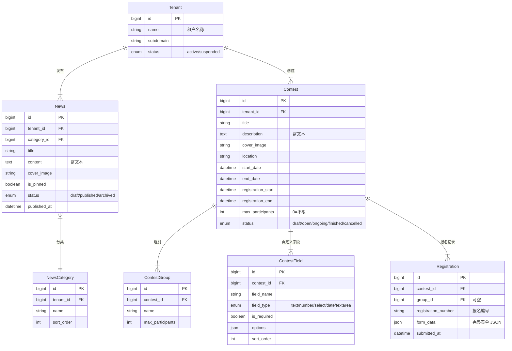

# 竞赛信息发布平台 — 功能需求

> 基于 PRD v1.0 提炼，聚焦 MVP 核心功能：新闻模块 + 赛事发布 + 报名数据导出。
> 技术栈：Python FastAPI + React/shadcn-ui + PostgreSQL + Redis

---

## 1. 核心业务流程

```
管理员创建赛事 → 配置报名表单 → 发布赛事 → 分享链接
                                              ↓
选手打开链接 → 浏览赛事 → 填写报名 → 提交成功（获得报名编号）
                                              ↓
管理员后台查看报名列表 → 筛选 → 一键导出 Excel（参赛人员名单）
```

两条核心线：
- **内容线**：新闻 CRUD → 前台展示 → 为门户提供基础内容
- **赛事线**：赛事创建 → 选手报名 → 报名管理 → Excel 导出

---

## 2. 系统角色

| 角色 | 说明 | 权限范围 |
|------|------|----------|
| 平台管理员 | SaaS 平台运维 | 全部租户（只看不操作业务数据） |
| 租户管理员 | 主办方运营人员 | 本租户全部功能 |
| 选手（匿名） | 参赛选手 | 浏览赛事、提交报名、查询成绩 |

MVP 阶段选手无需注册登录，通过「报名编号 + 手机号」标识身份。

---

## 3. 功能模块

### 3.1 多租户基础

每个主办方注册后自动开通独立租户，数据按 `tenant_id` 隔离。

- 注册即开通，无需审批
- 所有查询自动带上 `tenant_id`（中间件拦截）
- 每个租户拥有独立门户页（默认模板）

---

### 3.2 新闻模块

#### 3.2.1 功能概述

后台发布/编辑新闻，前台门户展示新闻列表。支撑赛事宣传和门户内容建设。

#### 3.2.2 新闻分类

- 每个租户独立分类，默认包含：赛事通知、行业动态、获奖公告
- 支持增删改，最多 20 个分类
- 某分类下无已发布新闻时，前台不展示该分类 Tab

#### 3.2.3 后台功能

**新闻列表页：**

| 查询条件 | 字段类型 | 说明 |
|----------|----------|------|
| 关键词 | 文本 | 搜索标题 |
| 分类 | 下拉 | 按分类筛选 |
| 状态 | 下拉 | 草稿 / 已发布 / 已归档 |

| 列表字段 | 说明 |
|----------|------|
| 标题 | 点击进入编辑 |
| 分类 | 标签展示 |
| 封面图 | 40×40 缩略图 |
| 置顶 | 📌 标识 |
| 状态 | 草稿 / 已发布 / 已归档 |
| 发布时间 | 按时间倒序 |
| 操作 | 编辑 / 置顶 / 发布 / 归档 / 删除 |

**新闻编辑页：**

| 字段 | 类型 | 必填 | 备注 |
|------|------|------|------|
| 标题 | 文本 | 是 | 最大 100 字符 |
| 分类 | 下拉 | 是 | 支持新建分类 |
| 封面图 | 图片上传 | 否 | 建议 900×500px |
| 正文 | 富文本 | 是 | 支持图片 |
| 摘要 | 文本域 | 否 | 自动提取前 200 字符 |

**操作按钮（按状态显示）：**

| 操作 | 触发条件 | 说明 |
|------|----------|------|
| 新建 | 始终 | 进入编辑页 |
| 编辑 | 始终 | 修改已有新闻 |
| 发布 | 当前为草稿 | 状态 → 已发布，前台可见 |
| 置顶/取消置顶 | 已发布 | 首页优先展示 |
| 归档 | 已发布 | 状态 → 已归档，前台不可见 |
| 删除 | 始终 | 软删除，二次确认 |

#### 3.2.4 前台展示

- 卡片式布局，按发布时间倒序
- 置顶新闻优先展示
- 分类 Tab 切换过滤
- 点击进入详情页（富文本渲染）

#### 3.2.5 业务规则

- 标题不可为空，不可超 100 字符
- 置顶新闻始终在最前
- 新闻摘要 = 正文去 HTML 标签后截取前 200 字符

---

### 3.3 赛事管理

#### 3.3.1 功能概述

管理员创建赛事、配置赛制信息、设置报名表单、控制赛事状态流转。赛事是平台核心业务实体。

#### 3.3.2 赛事状态流转

```
草稿 ──发布──→ 报名中 ──截止──→ 进行中 ──结束──→ 已结束
  │              │                    │
  └──保存编辑──→ 草稿    └──取消──→ 已取消（终态）
```

| 状态转换 | 触发方式 | 约束 |
|----------|----------|------|
| 创建 → 草稿 | 管理员 | 至少填写标题 |
| 草稿 → 报名中 | 管理员发布 | 必填字段完整 |
| 报名中 → 进行中 | 系统自动/管理员手动 | 报名截止时间到达 |
| 进行中 → 已结束 | 管理员手动 | — |
| 报名中 → 已取消 | 管理员 | 二次确认，不可恢复 |

#### 3.3.3 后台功能

**赛事列表页：**

| 查询条件 | 字段类型 |
|----------|----------|
| 关键词 | 文本（搜索标题） |
| 状态 | Tab：草稿 / 报名中 / 进行中 / 已结束 / 已取消 |

| 列表字段 | 说明 |
|----------|------|
| 标题 | 点击进入详情 |
| 组别 | 标签组展示 |
| 报名时间 | 起止时间 |
| 状态 | 彩色标签 |
| 报名人数 | 已报名 / 上限 |
| 创建时间 | 日期 |
| 操作 | 编辑 / 发布 / 结束 / 取消 / 复制 |

**创建/编辑赛事（分步表单）：**

**Step 1 — 基本信息：**

| 字段 | 类型 | 必填 | 备注 |
|------|------|------|------|
| 赛事标题 | 文本 | 是 | 最大 200 字符 |
| 封面图 | 图片上传 | 否 | 1200×630px |
| 赛事介绍 | 富文本 | 是 | — |
| 比赛地点 | 文本 | 是 | — |
| 比赛开始日期 | 日期 | 是 | — |
| 比赛结束日期 | 日期 | 是 | ≥ 开始日期 |
| 报名开始时间 | 日期时间 | 是 | — |
| 报名截止时间 | 日期时间 | 是 | ≤ 比赛开始 |
| 人数上限 | 数字 | 否 | 0 = 不限 |
| 联系方式 | 文本 | 否 | 咨询电话 |

**Step 2 — 组别设置：**

| 字段 | 类型 | 必填 |
|------|------|------|
| 组别名称 | 文本 | 是 |
| 组别说明 | 文本域 | 否 |
| 人数上限 | 数字 | 否 |

支持多组别（至少 1 个，最多 20 个）。

**Step 3 — 奖项设置：**

| 字段 | 类型 | 必填 |
|------|------|------|
| 奖项名称 | 文本 | 是 |
| 奖项说明 | 文本域 | 否 |

**Step 4 — 报名表单配置：**

系统默认字段（不可删除）：**姓名、手机号**

自定义字段（最多 20 个）：

| 配置项 | 说明 |
|--------|------|
| 字段名称 | 如「学校名称」 |
| 字段类型 | 文本 / 数字 / 单选 / 多选 / 日期 / 文本域 |
| 是否必填 | 开关，默认否 |
| 选项列表 | 单选/多选时，一行一个选项 |
| 排序 | 拖拽排序，影响表单展示顺序 |

#### 3.3.4 前台展示（选手端）

- 赛事封面 + 标题 + 介绍（富文本）
- 组别列表、奖项列表
- **报名中** 状态：显示报名入口按钮
- 报名截止倒计时
- 分享按钮（复制链接）

#### 3.3.5 业务规则

- 赛事标题在租户内唯一
- 报名截止时间 ≤ 比赛开始时间
- 报名截止到达时，系统自动将状态变更为「进行中」
- 组别人数满时，显示「已满」且不可选
- 已取消赛事不可恢复，可「复制创建」复用

---

### 3.4 在线报名

#### 3.4.1 功能概述

选手通过分享链接打开赛事页，填写报名表单并提交，提交即报名成功（无审核环节）。

#### 3.4.2 选手端页面

**报名表单页：**
- 系统固定字段：姓名、手机号
- 自定义字段：根据赛事配置动态渲染
- 组别选择（显示剩余名额）
- 隐私政策勾选
- 提交按钮（loading 防重复）

**报名成功页：**
- 成功图标 + 提示
- **报名编号**（大号展示 + 一键复制）
- 赛事信息摘要
- 提示保存编号以便后续查询

#### 3.4.3 字段校验

| 字段 | 规则 | 错误提示 |
|------|------|----------|
| 姓名 | 2-20 字符 | "请输入 2-20 位的真实姓名" |
| 手机号 | 11 位，1 开头 | "请输入正确的 11 位手机号" |
| 自定义必填 | 非空 | "请填写{字段名}" |
| 自定义文本 | ≤ 500 字符 | — |

#### 3.4.4 业务规则

- 同一手机号在同一赛事同一组别仅可报名一次
- 报名截止后不可提交
- 组别满员后不可选择
- 同一 IP 1 分钟内最多提交 3 次
- 报名编号格式：`C001-20260606-0001`（赛事ID后4位 + 年月日 + 4位自增序号）

---

### 3.5 报名管理

#### 3.5.1 功能概述

管理员查看报名记录，按条件筛选，查看详情。**核心输出：一键导出参赛人员名单为 Excel**。

#### 3.5.2 后台页面

**报名列表页：**

| 查询条件 | 字段类型 |
|----------|----------|
| 赛事 | 下拉（默认最近赛事） |
| 组别 | 下拉 |
| 关键词 | 文本（姓名/手机号/报名编号） |

| 列表字段 | 说明 |
|----------|------|
| 报名编号 | 可复制 |
| 姓名 | — |
| 手机号 | 脱敏（中间 4 位 *） |
| 组别 | 标签 |
| 自定义字段摘要 | 展示前 2-3 个字段值 |
| 报名时间 | 可排序 |
| 操作 | 查看详情 / 删除 |

**详情弹窗：**
- 全量字段展示（系统字段 + 自定义字段）
- 报名编号、报名时间
- 删除按钮（二次确认）

#### 3.5.3 业务规则

- 手机号列表脱敏，导出时显示完整号码
- 删除为软删除（数据保留 30 天后自动清理）
- 删除记审计日志

---

### 3.6 数据导出（核心）

#### 3.6.1 功能概述

这是客户最核心的诉求：**把参赛选手信息导出成 Excel**。支持按赛事导出报名数据和成绩数据，异步生成 + 下载。

#### 3.6.2 操作流程

```
选择赛事 → 选择组别 → 勾选导出字段 → 确认 → 后台生成 → 下载 Excel
```

#### 3.6.3 页面交互

| 步骤 | 内容 |
|------|------|
| 选择范围 | 赛事下拉 + 组别多选（全选/按组别） |
| 选择字段 | 勾选式：报名编号、姓名、手机号、组别、报名时间 + 所有自定义字段 |
| 确认 | 显示「预计导出 N 条记录」 |
| 下载 | 异步生成，完成后提示下载 |

#### 3.6.4 导出字段（报名数据）

| 系统字段 | 自定义字段 |
|----------|------------|
| 报名编号 | 根据赛事配置动态列出 |
| 姓名 | （如：学校、指导老师、身份证号等） |
| 手机号（导出时完整显示） | |
| 组别 | |
| 报名时间 | |

#### 3.6.5 业务规则

- 导出文件格式 `.xlsx`，UTF-8 编码
- 导出文件保留 7 天，超期自动清理
- 单次导出上限 50,000 条
- 导出操作记审计日志

---

## 4. 数据模型（核心实体）



---

## 5. 页面清单

### 5.1 管理后台（PC）

| 页面 | 路由 | 说明 |
|------|------|------|
| 登录页 | /admin/login | 账号密码登录 |
| 首页 | /admin | 赛事数量概览 |
| 新闻列表 | /admin/news | 表格 + 搜索过滤 |
| 新闻编辑 | /admin/news/:id | 富文本编辑 |
| 新闻分类 | /admin/news/categories | 增删改查 |
| 赛事列表 | /admin/contests | Tab 切换状态 |
| 赛事创建/编辑 | /admin/contests/new, /admin/contests/:id | 分步表单 |
| 报名列表 | /admin/registrations | 按赛事查看 |
| 数据导出 | /admin/export | 选择赛事 → 字段 → 下载 |

### 5.2 前台门户（H5/PC）

| 页面 | 路由 | 说明 |
|------|------|------|
| 门户首页 | /{subdomain} | 新闻列表 + 赛事列表 |
| 新闻详情 | /{subdomain}/news/:id | 富文本渲染 |
| 赛事详情 | /{subdomain}/contests/:id | 赛事信息 + 报名入口 |
| 报名表单 | /{subdomain}/contests/:id/register | 动态表单 |
| 报名成功 | /{subdomain}/contests/:id/register/success | 显示报名编号 |

---

## 6. API 概览

### 6.1 新闻

| 方法 | 路径 | 说明 |
|------|------|------|
| GET | /api/admin/news | 新闻列表（分页+筛选） |
| POST | /api/admin/news | 创建新闻 |
| PUT | /api/admin/news/:id | 编辑新闻 |
| PATCH | /api/admin/news/:id/status | 发布/归档 |
| DELETE | /api/admin/news/:id | 删除新闻 |
| GET | /api/admin/news/categories | 分类列表 |
| POST | /api/admin/news/categories | 创建分类 |
| PUT | /api/admin/news/categories/:id | 编辑分类 |
| DELETE | /api/admin/news/categories/:id | 删除分类 |

### 6.2 赛事

| 方法 | 路径 | 说明 |
|------|------|------|
| GET | /api/admin/contests | 赛事列表（分页+按状态筛选） |
| POST | /api/admin/contests | 创建赛事（含组别/奖项/字段） |
| PUT | /api/admin/contests/:id | 编辑赛事 |
| PATCH | /api/admin/contests/:id/status | 发布/结束/取消 |
| POST | /api/admin/contests/:id/copy | 复制赛事 |
| DELETE | /api/admin/contests/:id | 删除赛事 |

### 6.3 报名

| 方法 | 路径 | 说明 |
|------|------|------|
| GET | /api/public/contests/:id | 赛事详情（前台） |
| POST | /api/public/contests/:id/register | 提交报名 |
| GET | /api/admin/registrations | 报名列表（分页+筛选） |
| GET | /api/admin/registrations/:id | 报名详情 |
| DELETE | /api/admin/registrations/:id | 删除报名 |

### 6.4 数据导出

| 方法 | 路径 | 说明 |
|------|------|------|
| POST | /api/admin/export/registrations | 提交导出任务（赛事ID+组别+字段） |
| GET | /api/admin/export/tasks/:taskId | 查询导出任务状态 |
| GET | /api/admin/export/download/:taskId | 下载导出文件 |

### 6.5 门户前台

| 方法 | 路径 | 说明 |
|------|------|------|
| GET | /api/public/{subdomain}/home | 门户首页数据（新闻+赛事） |
| GET | /api/public/{subdomain}/news | 新闻列表 |
| GET | /api/public/{subdomain}/news/:id | 新闻详情 |

---

## 7. MVP 范围边界

### ✅ 本期包含

- 新闻 CRUD + 分类 + 前台展示
- 赛事创建 + 组别/奖项配置 + 自定义报名表单
- 选手在线报名（提交即成功，无需审核）
- 后台报名记录查看 + 筛选 + 删除
- **Excel 导出参赛人员名单**（异步生成 + 下载）
- 多租户基础（注册开通 + 数据隔离）

### ❌ 本期不包含

- 成绩管理（P0 但延后，先聚焦报名）
- 选手账户/登录
- 品牌化门户自定义配置
- 消息通知（短信/邮件/微信模板）
- 在线缴费
- 证书生成
- 数据看板

---

## 8. 非功能需求

| 指标 | 目标值 |
|------|--------|
| 报名提交响应 | P95 < 2s |
| 页面首屏加载 | < 3s |
| 导出支持上限 | 单次 50,000 条 |
| 传输安全 | 全站 HTTPS |
| 选手手机号 | 列表脱敏，导出明文，传输加密 |
| 多终端 | 前台 H5 + PC 正常渲染 |
