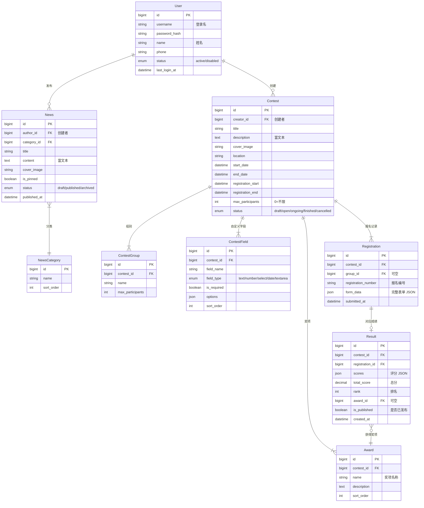

# 竞赛信息发布平台 — 功能需求

> 基于 PRD v1.0 提炼，聚焦 MVP 核心闭环：新闻模块 → 赛事发布 → 在线报名 → 数据导出 → 成绩管理。
> 技术栈：Python FastAPI + React/shadcn-ui + PostgreSQL + Redis
> 架构决策：MVP 阶段采用单租户架构，不引入多租户设计。

---

## 1. 核心业务流程

```
                        ┌─────────── 赛前 ───────────┐
                        │                            │
管理员 ──→ 发布新闻（宣传造势）                        │
      │                                              │
      └──→ 创建赛事 → 配置报名表单 → 发布赛事 → 分享链接
                                                    │
                        ┌─────────── 报名 ───────────┘
                        │
选手 ──→ 打开链接 → 浏览赛事 → 填写报名 → 提交成功（获得报名编号）
                        │
                        ├──→ 管理员查看报名列表 → 筛选 → 导出 Excel（参赛人员名单）
                        │
                        ┌─────────── 赛后 ───────────┐
                        │
管理员 ──→ 录入/导入成绩 → 核实无误 → 发布成绩
                        │
选手 ──→ 输入报名编号 + 手机号 → 查询个人成绩
                        │
管理员 ──→ 导出成绩 Excel（归档/报送）
```

三条核心线：
- **内容线**：新闻 CRUD → 前台展示 → 为网站提供基础内容
- **赛事线**：赛事创建 → 选手报名 → 报名管理 → Excel 导出
- **成绩线**：成绩录入/导入 → 发布 → 选手自助查询 → 成绩导出归档

---

## 2. 系统角色

### 2.1 管理员

MVP 阶段不区分角色，一个「管理员」账号拥有全部功能权限。可以有多个管理员账号（比如两个人一起管），但所有人的权限一样。

| 角色 | 说明 | 功能范围 |
|------|------|----------|
| 管理员 | 平台运营人员 | 新闻管理 + 赛事管理 + 报名管理 + 成绩管理 + 数据导出 + 管理其他管理员账号 |

> 后续可按需扩展角色分权（如只读账号、内容编辑），但 MVP 不搞。

### 2.2 选手

| 角色 | 说明 | 权限范围 |
|------|------|----------|
| 选手（匿名） | 参赛选手 | 浏览赛事、提交报名、查询成绩 |

MVP 阶段选手无需注册登录，通过「报名编号 + 手机号」标识身份。

---

## 3. 功能模块

### 3.1 管理员账号管理

#### 3.1.1 首个管理员

系统部署后通过数据库脚本或命令行创建初始管理员账号。后续所有管理员在后台创建，不开放公开注册。

#### 3.1.2 管理员列表

| 列表字段 | 说明 |
|----------|------|
| 用户名 | — |
| 姓名 | — |
| 状态 | 正常 / 已禁用 |
| 最后登录时间 | — |
| 操作 | 编辑 / 禁用 / 重置密码 |

**操作按钮：**

| 操作 | 说明 |
|------|------|
| 添加管理员 | 弹窗填写用户名/密码/姓名 |
| 编辑 | 修改姓名 |
| 禁用/启用 | 禁止该账号登录 |
| 重置密码 | 设为随机密码并提示修改 |

---

### 3.2 新闻模块

#### 3.2.1 功能概述

后台发布/编辑新闻，前台展示新闻列表。支撑赛事宣传和网站内容建设。

#### 3.2.2 新闻分类

- 默认分类：赛事通知、行业动态、获奖公告
- 支持增删改，最多 20 个分类
- 某分类下无已发布新闻时，前台不展示该分类 Tab

#### 3.2.3 后台功能

**新闻列表页：**

| 查询条件 | 字段类型 | 说明 |
|----------|----------|------|
| 关键词 | 文本 | 搜索标题 |
| 分类 | 下拉 | 按分类筛选 |
| 状态 | 下拉 | 草稿 / 已发布 / 已归档 |

| 列表字段 | 说明 |
|----------|------|
| 标题 | 点击进入编辑 |
| 分类 | 标签展示 |
| 封面图 | 40×40 缩略图 |
| 置顶 | 📌 标识 |
| 状态 | 草稿 / 已发布 / 已归档 |
| 发布时间 | 按时间倒序 |
| 操作 | 编辑 / 置顶 / 发布 / 归档 / 删除 |

**新闻编辑页：**

| 字段 | 类型 | 必填 | 备注 |
|------|------|:--:|------|
| 标题 | 文本 | 是 | 最大 100 字符 |
| 分类 | 下拉 | 是 | 支持新建分类 |
| 封面图 | 图片上传 | 否 | 建议 900×500px |
| 正文 | 富文本 | 是 | 支持图片 |
| 摘要 | 文本域 | 否 | 自动提取前 200 字符 |

**操作按钮（按状态显示）：**

| 操作 | 触发条件 | 说明 |
|------|----------|------|
| 新建 | 始终 | 进入编辑页 |
| 编辑 | 始终 | 修改已有新闻 |
| 发布 | 当前为草稿 | 状态 → 已发布，前台可见 |
| 置顶/取消置顶 | 已发布 | 首页优先展示 |
| 归档 | 已发布 | 状态 → 已归档，前台不可见 |
| 删除 | 始终 | 软删除，二次确认 |

#### 3.2.4 前台展示

- 卡片式布局，按发布时间倒序
- 置顶新闻优先展示
- 分类 Tab 切换过滤
- 点击进入详情页（富文本渲染）

#### 3.2.5 业务规则

- 标题不可为空，不可超 100 字符
- 置顶新闻始终在最前
- 新闻摘要 = 正文去 HTML 标签后截取前 200 字符

---

### 3.3 赛事管理

#### 3.3.1 功能概述

管理员创建赛事、配置赛制信息、设置报名表单、控制赛事状态流转。赛事是平台核心业务实体。

#### 3.3.2 赛事状态流转

```
草稿 ──发布──→ 报名中 ──截止──→ 进行中 ──结束──→ 已结束
  │              │                    │
  └──保存编辑──→ 草稿    └──取消──→ 已取消（终态）
```

| 状态转换 | 触发方式 | 约束 |
|----------|----------|------|
| 创建 → 草稿 | 管理员 | 至少填写标题 |
| 草稿 → 报名中 | 管理员发布 | 必填字段完整 |
| 报名中 → 进行中 | 系统自动/管理员手动 | 报名截止时间到达 |
| 进行中 → 已结束 | 管理员手动 | — |
| 报名中 → 已取消 | 管理员 | 二次确认，不可恢复 |

#### 3.3.3 后台功能

**赛事列表页：**

| 查询条件 | 字段类型 |
|----------|----------|
| 关键词 | 文本（搜索标题） |
| 状态 | Tab：草稿 / 报名中 / 进行中 / 已结束 / 已取消 |

| 列表字段 | 说明 |
|----------|------|
| 标题 | 点击进入详情 |
| 组别 | 标签组展示 |
| 报名时间 | 起止时间 |
| 状态 | 彩色标签 |
| 报名人数 | 已报名 / 上限 |
| 创建时间 | 日期 |
| 操作 | 编辑 / 发布 / 结束 / 取消 / 复制 |

**创建/编辑赛事（分步表单）：**

**Step 1 — 基本信息：**

| 字段 | 类型 | 必填 | 备注 |
|------|------|:--:|------|
| 赛事标题 | 文本 | 是 | 最大 200 字符 |
| 封面图 | 图片上传 | 否 | 1200×630px |
| 赛事介绍 | 富文本 | 是 | — |
| 比赛地点 | 文本 | 是 | — |
| 比赛开始日期 | 日期 | 是 | — |
| 比赛结束日期 | 日期 | 是 | ≥ 开始日期 |
| 报名开始时间 | 日期时间 | 是 | — |
| 报名截止时间 | 日期时间 | 是 | ≤ 比赛开始 |
| 人数上限 | 数字 | 否 | 0 = 不限 |
| 联系方式 | 文本 | 否 | 咨询电话 |

**Step 2 — 组别设置：**

| 字段 | 类型 | 必填 |
|------|------|:--:|
| 组别名称 | 文本 | 是 |
| 组别说明 | 文本域 | 否 |
| 人数上限 | 数字 | 否 |

支持多组别（至少 1 个，最多 20 个）。

**Step 3 — 奖项设置：**

| 字段 | 类型 | 必填 |
|------|------|:--:|
| 奖项名称 | 文本 | 是 |
| 奖项说明 | 文本域 | 否 |

**Step 4 — 报名表单配置：**

系统默认字段（不可删除）：**姓名、手机号**

自定义字段（最多 20 个）：

| 配置项 | 说明 |
|--------|------|
| 字段名称 | 如「学校名称」 |
| 字段类型 | 文本 / 数字 / 单选 / 多选 / 日期 / 文本域 |
| 是否必填 | 开关，默认否 |
| 选项列表 | 单选/多选时，一行一个选项 |
| 排序 | 拖拽排序，影响表单展示顺序 |

#### 3.3.4 前台展示（选手端）

- 赛事封面 + 标题 + 介绍（富文本）
- 组别列表、奖项列表
- **报名中** 状态：显示报名入口按钮
- 报名截止倒计时
- 分享按钮（复制链接）

#### 3.3.5 业务规则

- 赛事标题唯一
- 报名截止时间 ≤ 比赛开始时间
- 报名截止到达时，系统自动将状态变更为「进行中」
- 组别人数满时，显示「已满」且不可选
- 已取消赛事不可恢复，可「复制创建」复用

---

### 3.4 在线报名

#### 3.4.1 功能概述

选手通过分享链接打开赛事页，填写报名表单并提交，提交即报名成功（无审核环节）。

#### 3.4.2 选手端页面

**报名表单页：**
- 系统固定字段：姓名、手机号
- 自定义字段：根据赛事配置动态渲染
- 组别选择（显示剩余名额）
- 隐私政策勾选
- 提交按钮（loading 防重复）

**报名成功页：**
- 成功图标 + 提示
- **报名编号**（大号展示 + 一键复制）
- 赛事信息摘要
- 提示保存编号以便后续查询成绩

#### 3.4.3 字段校验

| 字段 | 规则 | 错误提示 |
|------|------|----------|
| 姓名 | 2-20 字符 | "请输入 2-20 位的真实姓名" |
| 手机号 | 11 位，1 开头 | "请输入正确的 11 位手机号" |
| 自定义必填 | 非空 | "请填写{字段名}" |
| 自定义文本 | ≤ 500 字符 | — |

#### 3.4.4 业务规则

- 同一手机号在同一赛事同一组别仅可报名一次
- 报名截止后不可提交
- 组别满员后不可选择
- 同一 IP 1 分钟内最多提交 3 次
- 报名编号格式：`C001-20260606-0001`（赛事ID后4位 + 年月日 + 4位自增序号）

---

### 3.5 报名管理

#### 3.5.1 功能概述

管理员查看报名记录，按条件筛选，查看详情。**核心输出：一键导出参赛人员名单为 Excel**。

#### 3.5.2 后台页面

**报名列表页：**

| 查询条件 | 字段类型 |
|----------|----------|
| 赛事 | 下拉（默认最近赛事） |
| 组别 | 下拉 |
| 关键词 | 文本（姓名/手机号/报名编号） |

| 列表字段 | 说明 |
|----------|------|
| 报名编号 | 可复制 |
| 姓名 | — |
| 手机号 | 脱敏（中间 4 位 *） |
| 组别 | 标签 |
| 自定义字段摘要 | 展示前 2-3 个字段值 |
| 报名时间 | 可排序 |
| 操作 | 查看详情 / 删除 |

**详情弹窗：**
- 全量字段展示（系统字段 + 自定义字段）
- 报名编号、报名时间
- 删除按钮（二次确认）

#### 3.5.3 业务规则

- 手机号列表脱敏，导出时显示完整号码
- 删除为软删除（数据保留 30 天后自动清理）
- 删除记审计日志

---

### 3.6 成绩管理

#### 3.6.1 功能概述

赛后管理员录入或批量导入成绩，核实无误后一键发布。选手通过「报名编号 + 手机号」自助查询个人成绩。成绩数据同样支持 Excel 导出归档。

#### 3.6.2 业务流程

```
管理员选择赛事 → 录入方式 ─┬─ 逐条录入：在报名记录上填写分数
                          └─ 批量导入：下载模板 → 填写 Excel → 上传
                          ↓
                    保存成绩（草稿）
                          ↓
                    预览成绩列表 → 核实无误 → 一键发布
                          ↓
                    选手端开放查询（报名编号 + 手机号验证）
                          ↓
                    成绩数据导出（配合 3.7 数据导出）
```

#### 3.6.3 后台页面

**成绩列表页：**

| 查询条件 | 字段类型 | 说明 |
|----------|----------|------|
| 赛事 | 下拉 | 选择目标赛事（仅显示「已结束」状态） |
| 组别 | 下拉 | 按组别筛选 |
| 发布状态 | Tab | 草稿 / 已发布 |
| 关键词 | 文本 | 搜索姓名 / 报名编号 |

| 列表字段 | 说明 |
|----------|------|
| 报名编号 | 可复制 |
| 姓名 | — |
| 组别 | 标签 |
| 各项得分 | 显示评分 JSON 摘要 |
| 总分 | 可排序 |
| 排名 | 自动生成（同分同名次） |
| 奖项 | 标签 |
| 发布状态 | 草稿 / 已发布 |
| 操作 | 编辑成绩 / 删除 |

**操作按钮：**

| 操作 | 触发条件 | 说明 |
|------|----------|------|
| 录入成绩 | 赛事状态 = 已结束 | 弹窗逐条编辑 |
| 批量导入 | 同上 | 下载模板 → 上传 Excel |
| 下载模板 | 同上 | 按当前赛事生成导入模板 |
| 发布成绩 | 已录入 ≥ 1 条 | 草稿 → 已发布，选手端可见 |
| 撤回成绩 | 已发布 | → 草稿，选手端不可见，二次确认 |
| 导出成绩 | 始终 | 跳转数据导出模块 |

**成绩录入弹窗：**

| 字段 | 类型 | 说明 |
|------|------|------|
| 报名编号 + 姓名 | 只读 | 确认录入对象 |
| 评分项（可配置） | 数字 | 默认：客观题得分、主观题得分，管理员可在赛事配置中自定义 |
| 总分 | 自动计算 | = Σ 各评分项 |
| 排名 | 自动/手动 | 默认按总分降序自动生成 |
| 奖项 | 下拉 | 对应赛事设置的奖项列表 |

**Excel 导入模板：**

| 列 | 必填 | 说明 |
|----|:--:|------|
| 报名编号 | 是 | 与系统一致，不匹配的行跳过并提示 |
| 评分项 … | 视配置 | 数字，保留 2 位小数 |
| 总分 | 否 | 留空自动计算 |
| 排名 | 否 | 留空自动生成 |
| 奖项 | 否 | 须与系统中奖项名称完全一致 |

#### 3.6.4 选手端（成绩查询）

- 入口：赛事详情页 → 成绩查询（仅「已结束」状态显示）
- 表单：报名编号 + 手机号
- 验证通过 → 显示：姓名、组别、各项得分、总分、排名、奖项
- 成绩未发布 → 提示「成绩暂未公布，请留意通知」
- 同一手机号 1 分钟内最多查询 5 次

#### 3.6.5 业务规则

| 编号 | 规则 |
|------|------|
| R1 | 一个报名记录最多对应一条成绩 |
| R2 | 成绩只能在赛事状态为「已结束」时录入 |
| R3 | 已发布成绩可撤回，撤回后选手端不可见，需二次确认 |
| R4 | 总分 = Σ(各评分项得分) |
| R5 | 排名 = 按总分降序，同分并列（如并列第 3，下一位为第 5） |
| R6 | Excel 导入逐行校验，报名编号不匹配的行跳过并在报告中标注 |
| R7 | 选手查询需同时验证报名编号 + 手机号，双重匹配 |

---

### 3.7 数据导出

#### 3.7.1 功能概述

这是客户最核心的诉求：**把数据导出成 Excel，方便归档和报送**。支持两种导出类型：

| 导出类型 | 数据来源 | 场景 |
|----------|----------|------|
| 报名数据 | Registration | 赛前/赛中——导出参赛人员名单 |
| 成绩数据 | Result | 赛后——导出成绩汇总表归档 |

#### 3.7.2 操作流程

```
选择导出类型 → 选择赛事 → 选择组别 → 勾选字段 → 确认 → 后台异步生成 → 下载 Excel
```

#### 3.7.3 页面交互

| 步骤 | 内容 |
|------|------|
| 选择类型 | 报名数据 / 成绩数据 |
| 选择范围 | 赛事下拉 + 组别多选（全选/按组别） |
| 选择字段 | 勾选式，系统字段默认选中，自定义字段按需勾选 |
| 确认 | 显示「预计导出 N 条记录」 |
| 下载 | 异步生成，完成后提示下载，7 天内有效 |

#### 3.7.4 可选导出字段

**报名数据导出字段：**

| 系统字段（默认） | 自定义字段 |
|------------------|------------|
| 报名编号 | 根据赛事配置动态列出 |
| 姓名 | （如：学校、指导老师等） |
| 手机号（导出完整显示） | |
| 组别 | |
| 报名时间 | |

**成绩数据导出字段：**

| 字段 | 默认选中 |
|------|:--------:|
| 报名编号 | ✓ |
| 姓名 | ✓ |
| 手机号 | ✓ |
| 组别 | ✓ |
| 各评分项得分 | ✓ |
| 总分 | ✓ |
| 排名 | ✓ |
| 奖项 | ✓ |

#### 3.7.5 业务规则

- 导出格式 `.xlsx`，UTF-8 编码
- 文件保留 7 天，超期自动清理
- 单次上限 50,000 条
- 导出操作为异步任务，提交后后台生成
- 导出记审计日志（谁、何时、导出什么数据）

---

## 4. 数据模型（核心实体）



---

## 5. 页面清单

### 5.1 管理后台（PC）

| 页面 | 路由 | 说明 |
|------|------|------|
| 登录页 | /admin/login | 账号密码登录 |
| 首页 | /admin | 赛事数量概览 |
| 管理员管理 | /admin/users | 添加/编辑/禁用/重置密码 |
| 新闻列表 | /admin/news | 表格 + 搜索过滤 |
| 新闻编辑 | /admin/news/:id | 富文本编辑 |
| 新闻分类 | /admin/news/categories | 增删改查 |
| 赛事列表 | /admin/contests | Tab 切换状态 |
| 赛事创建/编辑 | /admin/contests/new, /admin/contests/:id | 分步表单 |
| 报名列表 | /admin/registrations | 按赛事查看 |
| 成绩列表 | /admin/results | 按赛事查看，Tab 切换 |
| 成绩录入 | /admin/results/:id/edit | 弹窗逐条录入 |
| 数据导出 | /admin/export | 选择类型 → 赛事 → 字段 |

### 5.2 前台门户（H5/PC）

| 页面 | 路由 | 说明 |
|------|------|------|
| 首页 | / | 新闻列表 + 赛事列表 |
| 新闻详情 | /news/:id | 富文本渲染 |
| 赛事详情 | /contests/:id | 赛事信息 + 报名入口 |
| 报名表单 | /contests/:id/register | 动态表单 |
| 报名成功 | /contests/:id/register/success | 显示报名编号 |
| 成绩查询 | /contests/:id/results | 输入编号+手机号查成绩 |

---

## 6. API 概览

### 6.1 认证

| 方法 | 路径 | 说明 |
|------|------|------|
| POST | /api/auth/login | 管理员登录（返回 JWT） |
| POST | /api/auth/logout | 退出登录 |

### 6.2 管理员管理

| 方法 | 路径 | 说明 |
|------|------|------|
| GET | /api/admin/users | 管理员列表 |
| POST | /api/admin/users | 添加管理员 |
| PUT | /api/admin/users/:id | 编辑管理员姓名 |
| PATCH | /api/admin/users/:id/status | 启用/禁用 |
| POST | /api/admin/users/:id/reset-password | 重置密码 |

### 6.3 新闻

| 方法 | 路径 | 说明 |
|------|------|------|
| GET | /api/admin/news | 新闻列表（分页+筛选） |
| POST | /api/admin/news | 创建新闻 |
| PUT | /api/admin/news/:id | 编辑新闻 |
| PATCH | /api/admin/news/:id/status | 发布/归档 |
| DELETE | /api/admin/news/:id | 删除新闻 |
| GET | /api/admin/news/categories | 分类列表 |
| POST | /api/admin/news/categories | 创建分类 |
| PUT | /api/admin/news/categories/:id | 编辑分类 |
| DELETE | /api/admin/news/categories/:id | 删除分类 |

### 6.4 赛事

| 方法 | 路径 | 说明 |
|------|------|------|
| GET | /api/admin/contests | 赛事列表（分页+按状态筛选） |
| POST | /api/admin/contests | 创建赛事（含组别/奖项/字段） |
| PUT | /api/admin/contests/:id | 编辑赛事 |
| PATCH | /api/admin/contests/:id/status | 发布/结束/取消 |
| POST | /api/admin/contests/:id/copy | 复制赛事 |
| DELETE | /api/admin/contests/:id | 删除赛事 |

### 6.5 报名

| 方法 | 路径 | 说明 |
|------|------|------|
| GET | /api/public/contests/:id | 赛事详情（前台） |
| POST | /api/public/contests/:id/register | 提交报名 |
| GET | /api/admin/registrations | 报名列表（分页+筛选） |
| GET | /api/admin/registrations/:id | 报名详情 |
| DELETE | /api/admin/registrations/:id | 删除报名 |

### 6.6 成绩

| 方法 | 路径 | 说明 |
|------|------|------|
| GET | /api/admin/results | 成绩列表（分页+按赛事/组别/发布状态筛选） |
| POST | /api/admin/results | 逐条录入/编辑成绩 |
| POST | /api/admin/results/import | 批量导入 Excel |
| GET | /api/admin/results/template | 下载 Excel 导入模板 |
| PATCH | /api/admin/results/:id/publish | 发布成绩 |
| PATCH | /api/admin/results/:id/withdraw | 撤回成绩 |
| POST | /api/public/contests/:id/query-result | 选手查成绩（报名编号+手机号） |

### 6.7 数据导出

| 方法 | 路径 | 说明 |
|------|------|------|
| POST | /api/admin/export | 提交导出任务（type+赛事ID+组别+字段） |
| GET | /api/admin/export/tasks/:taskId | 查询导出任务状态 |
| GET | /api/admin/export/download/:taskId | 下载导出文件 |

### 6.8 门户前台

| 方法 | 路径 | 说明 |
|------|------|------|
| GET | /api/public/home | 首页数据（新闻列表+赛事列表） |
| GET | /api/public/news | 新闻列表 |
| GET | /api/public/news/:id | 新闻详情 |

---

## 7. MVP 范围边界

### ✅ 本期包含

- 管理员账号管理（添加/编辑/禁用/重置密码）
- 新闻 CRUD + 分类 + 前台展示
- 赛事创建 + 组别/奖项配置 + 自定义报名表单
- 选手在线报名（提交即成功，无需审核）
- 后台报名记录查看 + 筛选 + 删除
- **Excel 导出参赛人员名单和成绩数据**（异步生成 + 下载）
- **成绩管理**（逐条录入 + Excel 批量导入 + 发布/撤回 + 选手自助查询）

### ❌ 本期不包含

- 选手账户/登录
- 多租户/SaaS 化
- 前台品牌化自定义配置
- 消息通知（短信/邮件/微信模板）
- 在线缴费
- 证书生成
- 数据看板

---

## 8. 非功能需求

| 指标 | 目标值 |
|------|--------|
| 报名提交响应 | P95 < 2s |
| 页面首屏加载 | < 3s |
| 导出支持上限 | 单次 50,000 条 |
| 传输安全 | 全站 HTTPS |
| 选手手机号 | 列表脱敏，导出明文，传输加密 |
| 多终端适配 | 前台 H5 + PC 正常渲染 |
